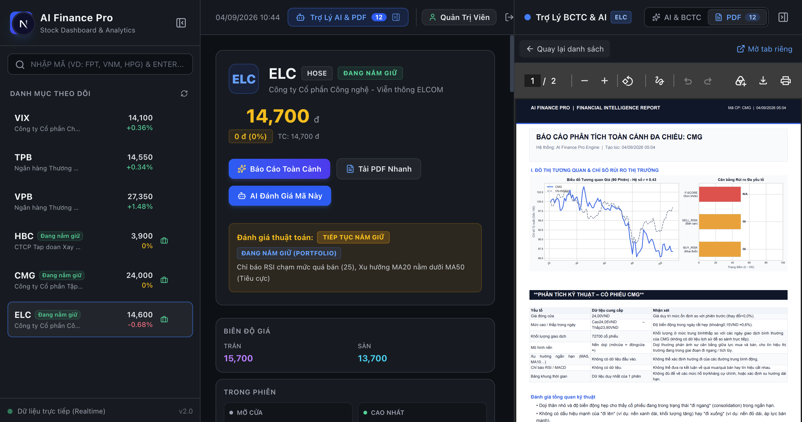
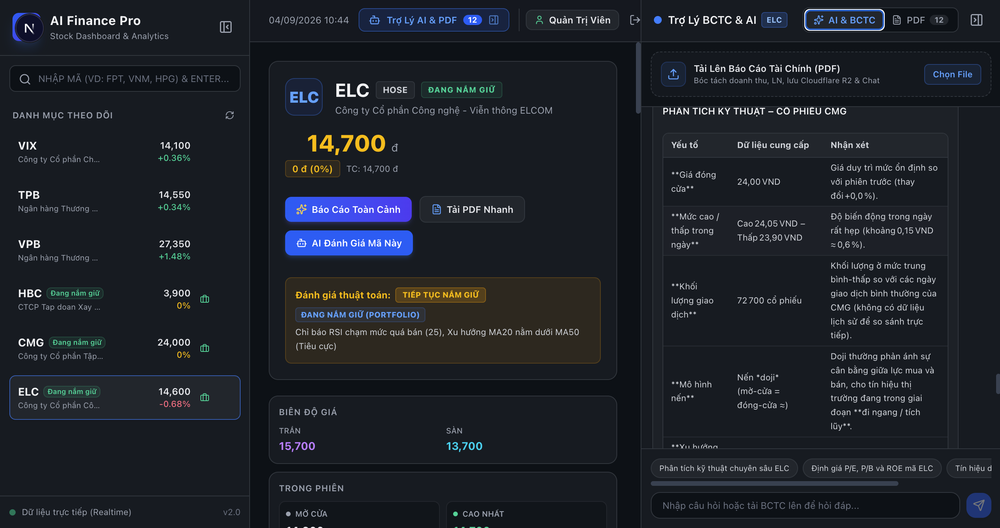
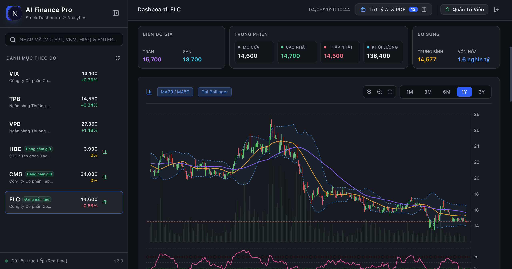
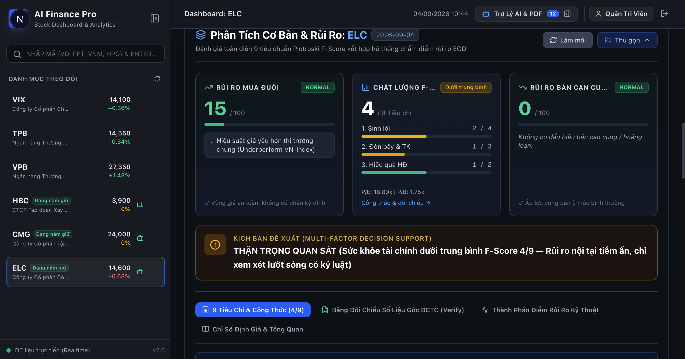
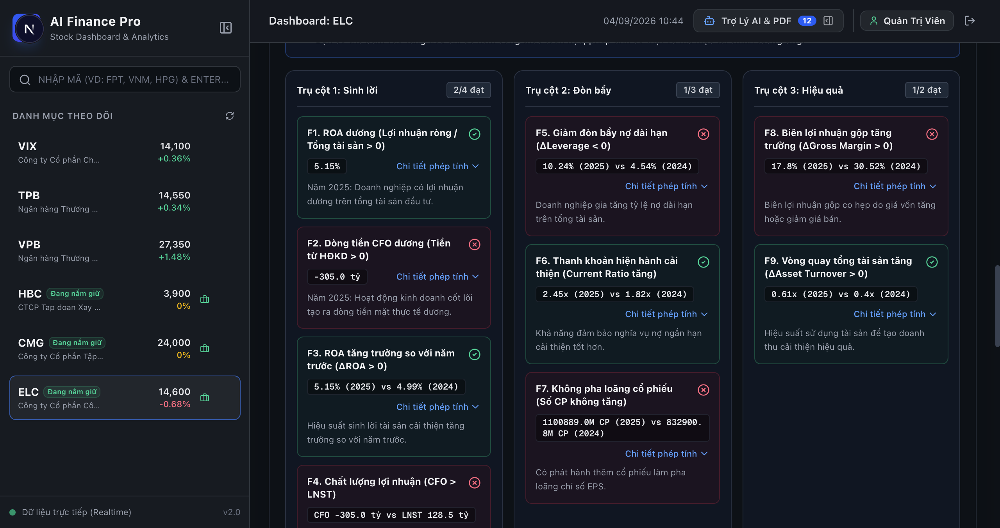
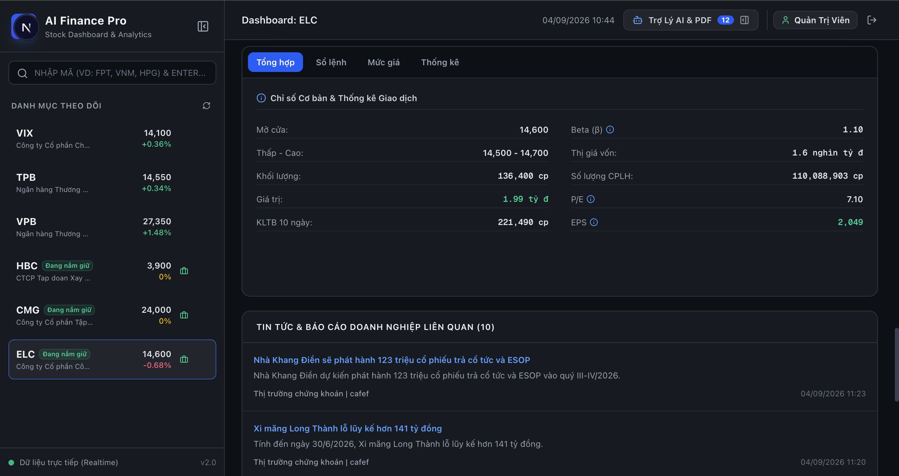
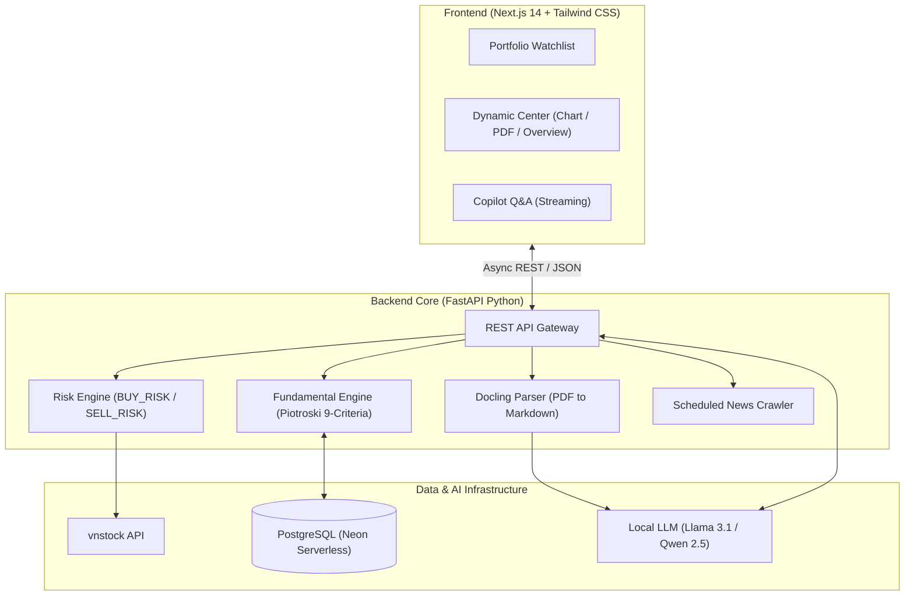

# AI Finance Pro — Smart Financial & Stock Analysis Platform

<div align="center">


-orange?style=for-the-badge&logo=ollama&logoColor=white)


**An enterprise-grade, automated financial analysis workspace that unifies quantitative technical data, deep PDF financial statement extraction, and local AI reasoning into a single seamless dashboard.**

[Explore Features](#-core-features--mvp-walkthrough) • [Quickstart](#-quickstart--installation) • [Architecture](#-system-architecture) • [Roadmap](#-roadmap)

</div>

---

## Executive Summary & Problem Statement

For retail investors and financial analysts, evaluating market opportunities often involves hours of painful manual effort:

* **The Problem (As-Is):** Sifting through fragmented news outlets, manually parsing complex multi-page financial statements (BCTC PDF), calculating technical indicators on separate charting platforms, and making emotionally compromised trading decisions (e.g., FOMO buying at the peak or panic selling at supply exhaustion).
* **The Solution (To-Be - AI Finance Pro):** An all-in-one Single Page Application (SPA) combining:
  1. **Real-time market ingestion** via `vnstock`.
  2. **100% table-preserving PDF financial report parsing** via `Docling`.
  3. **Algorithmic risk evaluation** (`BUY_RISK`, `SELL_RISK`, and Piotroski F-Score).
  4. **Privacy-first, zero-hallucination local AI copilot** powered by local LLMs (Ollama) with strict no-financial-advice guardrails.

> **Result:** Research time per ticker drops from **~45 minutes down to under 2 minutes**, with 100% objective, emotion-free risk scoring.

---

## Core Features & MVP Walkthrough

### 1. Unified Multi-Dimensional Dashboard & PDF Viewer

A frictionless 3-panel workspace: real-time watchlist on the left, interactive central stage, and AI copilot on the right. Instantly switch between comprehensive algorithmic overview, technical charts, and embedded PDF reports without page reloads.

<p align="center">
  
</p>

* **Portfolio Watchlist:** Real-time tracking of personal holdings and key market movers.
* **Instant Actionable Insights:** Algorithmic verdict (e.g., *"Tiếp tục nắm giữ"*) coupled with MA20/MA50 and RSI status.
* **Embedded High-Fidelity PDF Viewer:** Inspect original earnings releases side-by-side with AI summaries.

---

### 2. Conversational Financial Copilot & PDF Ingestion

Directly upload company earnings releases (`.pdf`). Our parsing pipeline preserves complex balance sheets, income statements, and cash flow structures into clean Markdown before feeding them into local AI.

<p align="center">
  
</p>

* **Document Parsing Engine:** Upload files up to 50MB; tables and footnotes stay intact.
* **Context-Aware Q&A:** Ask complex questions (e.g., *"Why did short-term debt spike in Q3?"*), backed by exact citations.
* **Suggested Inquiries:** Pre-built prompts for in-depth technical breakdowns, P/E & P/B valuation, and dividend sustainability checks.

---

### 3. Professional Interactive Charting & Price Discovery

High-performance charting system equipped with moving averages, volatility bands, volume bars, and intraday boundaries.

<p align="center">
  
</p>

* **Technical Overlays:** One-click toggle for MA20, MA50, and Bollinger Bands.
* **Multi-Horizon Analysis:** Rapid switching between 1M, 3M, 6M, 1Y, and 3Y timelines.
* **Live Market Dynamics:** Track ceiling, floor, VWAP, intraday range, and aggregate market capitalization.

---

### 4. Quantitative Risk Engine & Decision Support

Eliminate subjective guesswork with mathematical risk modeling. Two independent risk indicators evaluate the hazards of buying or selling at any given moment.

<p align="center">
  
</p>

* **`BUY_RISK` (0-100):** Quantifies FOMO risk by scanning for bearish RSI divergence (`MOM_BEAR_DIV`) and abnormal volume surges.
* **`SELL_RISK` (0-100):** Alerts when supply is exhausted to prevent panic selling at market bottoms.
* **Automated Decision Scenarios:** Clear multi-factor guidance (e.g., *"THẬN TRỌNG QUAN SÁT — F-Score 4/9"*).

---

### 5. Piotroski F-Score 9-Criteria Health Matrix

Complete fundamental health audit based on Joseph Piotroski's renowned 9-point criteria across three corporate finance pillars.

<p align="center">
  
</p>

| Pillar | Evaluated Metrics | Purpose |
| :--- | :--- | :--- |
| **Pillar 1: Profitability** | ROA > 0, CFO > 0, $\Delta$ROA > 0, CFO > Net Income | Verifies genuine earnings quality and cash generation. |
| **Pillar 2: Leverage & Liquidity** | $\Delta$Leverage < 0, $\Delta$Current Ratio > 0, No Dilution | Checks insolvency resilience and capital discipline. |
| **Pillar 3: Operating Efficiency** | $\Delta$Gross Margin > 0, $\Delta$Asset Turnover > 0 | Measures operational leverage and asset productivity. |

---

### 6. Trading Statistics & Targeted News Intelligence

Holistic market snapshot combining valuation fundamentals with automated, ticker-specific macro and company news.

<p align="center">
  
</p>

* **Core Financial Indicators:** Real-time Beta ($\beta$), P/E, EPS, Volume averages (10-day), and Shares outstanding.
* **Targeted News Aggregator:** Filters noise and surfaces ticker-relevant corporate announcements, dividend records, and macro news.

---

## 🏗 System Architecture



---

## 🚀 Quickstart & Installation

### 1. Prerequisites

* **Python**: `3.10+`
* **Node.js**: `18.x+`
* **PostgreSQL**: Local instance or cloud (e.g. Neon.tech)
* **Ollama**: Installed locally with `llama3.1:8b` or `qwen2.5:7b` (Optional for AI Q&A)

### 2. Backend Setup

```bash
# Navigate to backend
cd backend

# Create and activate virtual environment
python3 -m venv .venv
source .venv/bin/activate  # Windows: .venv\Scripts\activate

# Install dependencies
pip install -U pip
pip install -r requirements.txt

# Configure environment variables
cp .env.example .env  # Update DATABASE_URL and VNSTOCK_API_KEY

# Run database migrations
alembic upgrade head

# Start FastAPI server
uvicorn app.main:app --host 0.0.0.0 --port 8001 --reload
```

* Backend API: `http://localhost:8001`
* Interactive API Docs: `http://localhost:8001/docs`

### 3. Frontend Setup

```bash
# Navigate to frontend
cd frontend

# Install packages
npm install

# Start Next.js development server
npm run dev
```

* Web Application: `http://localhost:3000`

---

## Security, Privacy & Guardrails

1. **100% Local Inference:** Financial data and internal PDF documents remain private when running with local Ollama models.
2. **Deterministic Financial Extractions:** Metrics are extracted directly from tables—no probabilistic rounding or hallucinated financial figures.
3. **No-Advice Mandate:** Prompts are enforced with strict system guardrails. The AI delivers risk probabilities and factual analysis only, never speculative buy/sell commands.

---

## Roadmap

* [x] Multi-panel Single Page Application (SPA) dashboard.
* [x] Real-time market feed integration via `vnstock`.
* [x] Docling PDF financial statement extractor.
* [x] Piotroski F-Score & BUY/SELL Risk algorithms.
* [x] Conversational Q&A copilot.
* [ ] Multi-portfolio backtesting simulator.
* [ ] Webhook alerts for sudden risk score spikes via Telegram/Discord.
* [ ] Exportable executive PDF briefings.

---

<div align="center">
<sub>Built with precision for modern quantitative and fundamental investors.</sub>
</div>
