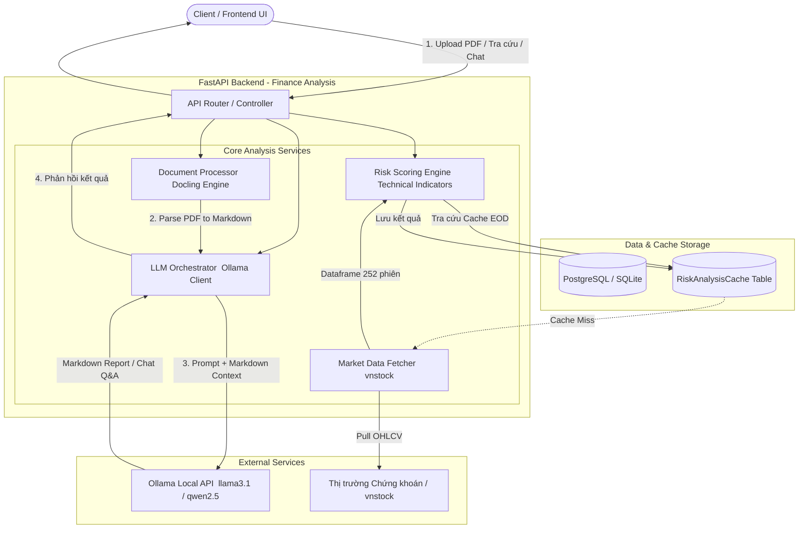
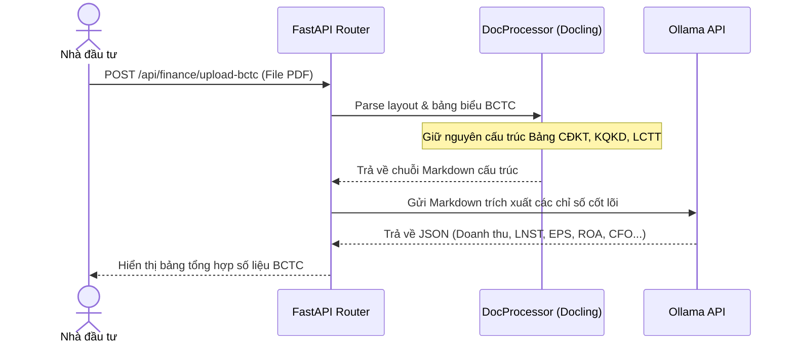
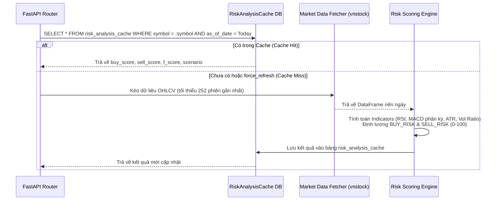
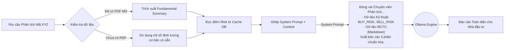

# THIẾT KẾ KIẾN TRÚC & WORKFLOW: FINANCE ANALYSIS

*(Tài liệu Thiết kế Kiến trúc & Giải pháp theo Kỹ thuật BDA / Solution Architecture Blueprint)*

---

## 1. Tổng quan Kiến trúc Hệ thống (System Architecture)

Hệ thống **Finance Analysis** được thiết kế theo mô hình **Modular Service-Oriented Architecture** trên nền tảng FastAPI (Python Backend), nhằm phân tách rõ ràng 3 trục xử lý:

1. **Xử lý tài liệu phi cấu trúc:** Chuyển đổi PDF BCTC sang Markdown thông qua `Docling`.
2. **Tính toán định lượng:** Thu thập OHLCV qua `vnstock`, tính toán F-Score và Risk Scores (`BUY_RISK`, `SELL_RISK`) lưu vào `RiskAnalysisCache`.
3. **Điều phối mô hình AI:** Sử dụng `Ollama` (local `llama3.1` / `qwen2.5`) để phân tích ngữ cảnh và tổng hợp báo cáo.

---

## 2. Thiết kế Luồng Dữ liệu (Workflows & Sequence Diagrams)

### 2.1. Workflow 1: Bóc tách Báo cáo Tài chính (Fundamental Flow)

Xử lý trích xuất văn bản và bảng biểu từ file PDF người dùng tải lên.

### 2.2. Workflow 2: Phân tích Rủi ro Kỹ thuật & Caching (Technical Flow)

Xử lý tính toán điểm rủi ro và tận dụng cơ chế bộ nhớ đệm `RiskAnalysisCache`.

### 2.3. Workflow 3: Sinh Báo cáo Đa chiều Tổng hợp (Multi-Dimensional Report)

Kết hợp cả 2 trục Fundamental và Technical để Ollama sinh báo cáo toàn cảnh.

---

## 3. Bản đồ Thành phần & Module Kỹ thuật Cần Phát triển

| Module | Đường dẫn file | Công nghệ / Thư viện | Trách nhiệm chính | Trạng thái hiện tại |
| --- | --- | --- | --- | :---: |
| **Technical Risk Engine** | `backend/app/services/risk_scoring.py` `backend/app/services/technical_indicators.py` | `numpy`, `pandas` | Tính RSI, MACD, phân kỳ, Price Z, Volume ratio, chấm điểm `BUY_RISK` / `SELL_RISK` | **Đã hoàn thiện (90%)** |
| **Risk Cache Model** | `backend/app/models.py` (`RiskAnalysisCache`) | `SQLAlchemy` | Bảng lưu trữ kết quả phân tích theo mã và ngày | **Đã hoàn thiện (100%)** |
| **Fundamental Service** | `backend/app/services/fundamental_indicators.py` | `python`, `vnstock` | Tính toán Piotroski F-Score (0-9) | **Đã hoàn thiện (90%)** |
| **Document Processor** | `backend/app/services/pdf_processor.py` *(Mới)* | `docling` | Parse PDF BCTC sang chuỗi Markdown bảo toàn bảng biểu | **Chưa triển khai (0%)** |
| **LLM Orchestrator** | `backend/app/services/ai_orchestrator_service.py` | `ollama`, `LLMGateway` | Tích hợp prompt đọc Markdown BCTC và prompt tổng hợp báo cáo | **Đã có khung (75%)** |
| **Finance Analysis Router** | `backend/app/routers/finance_analysis_router.py` *(Mới)* | `FastAPI`, `Pydantic` | Cung cấp endpoints: `/upload-bctc`, `/risk/{symbol}`, `/report`, `/chat` | **Chưa triển khai (0%)** |
