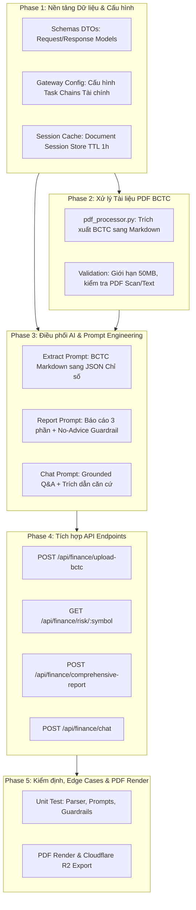

# KẾ HOẠCH PHÂN CHIA GIAI ĐOẠN PHÁT TRIỂN (PHASED IMPLEMENTATION PLAN)
## DỰ ÁN: FINANCE ANALYSIS — BDA AGENT SYSTEM

*(Tài liệu Brainstorming Kiến trúc & Lộ trình Triển khai Code theo chuẩn BDA / System Architecture Blueprint)*

---

## 1. PHÂN TÍCH TỔNG QUAN & HIỆN TRẠNG (PROBLEM & GAP ANALYSIS)

### 1.1. Hiện trạng Codebase đã có sẵn
Qua khảo sát chi tiết source code hiện hữu:
1. **Technical Risk Scoring Engine (`app/services/risk_scoring.py`, `technical_indicators.py`)**:
   - Đã hoàn thiện tính toán 19 mã cảnh báo (`MOM_BEAR_DIV`, `RSI_OVERBOUGHT`, `CAPITULATION_VOLUME_LOWER_WICK`...).
   - Đã chấm điểm độc lập `BUY_RISK` (0-100) và `SELL_RISK` (0-100) và tích hợp benchmark so sánh tương quan VN-Index.
2. **Fundamental Analysis Service (`app/services/fundamental_indicators.py`)**:
   - Đã cài đặt hoàn chỉnh 9 tiêu chí Piotroski F-Score (Lợi nhuận, Đòn bẩy/Thanh khoản, Hiệu quả hoạt động) cùng các chỉ số định giá P/E, P/B, ROE, ROA từ `vnstock`.
3. **Mô hình Dữ liệu & Caching (`app/models.py`)**:
   - Đã có bảng `RiskAnalysisCache` lưu trữ kết quả phân tích rủi ro và F-Score theo mã và ngày (`as_of_date`), tránh tính toán lặp lại trong ngày giao dịch (EOD).
   - Đã có bảng `GeneratedReport` lưu trữ metadata file PDF báo cáo trên Cloudflare R2 / Local storage.
4. **Hạ tầng LLM Gateway (`app/infra/gateway`, `app/infra/gw_config.py`)**:
   - Đã xây dựng hoàn chỉnh kiến trúc Gateway: `LLMGateway`, các adapter kết nối `Ollama`, `Gemini`, `OpenRouter`.
   - Có cơ chế xử lý lỗi mạng, timeout, rate limit (HTTP 429), retry tự động và cờ `thinking_disabled` để triệt tiêu `<think>` tokens của các model suy luận cục bộ (Ollama).
5. **Router hiện tại (`app/routers/analyze_router.py`, `report_router.py`)**:
   - Đã có `GET /api/analyze/risk/{symbol}` để tra cứu điểm rủi ro & F-score có caching DB.
   - Đã có `POST /api/analyze/overview` và `POST /api/analyze/detail` phục vụ tổng quan thị trường dạng tĩnh/cơ bản.

### 1.2. Các khoảng trống cốt lõi cần phát triển (Core Missing Capabilities)
Đối chiếu với tài liệu `docs/bda_agent/requirements_analysis.md` và `architecture_design.md`, hệ thống đang thiếu 4 cấu phần then chốt:

| Thành phần thiếu | Mô tả chi tiết | Yêu cầu BDA tương ứng |
|---|---|---|
| **1. PDF Document Processor** | Module `app/services/pdf_processor.py` chuyển đổi file PDF BCTC sang Markdown giữ nguyên cấu trúc bảng biểu tài chính (Bảng CĐKT, KQKD, LCTT). | **FR-001**, **BR-001**, **BR-002** |
| **2. Cấu hình Chain & AI Prompts chuyên sâu** | Cấu hình Fallback Chains tài chính trong `gw_config.py` và bổ sung 3 logic prompt trọng yếu vào `ai_orchestrator_service.py`: Trích xuất chỉ số BCTC (JSON), Sinh Báo cáo 3 phần toàn cảnh, Hỏi đáp Q&A có dẫn chứng. | **FR-002**, **FR-005**, **FR-006**, **BR-007**, **BR-008** |
| **3. Quản lý Session Ngữ cảnh BCTC** | Cơ chế lưu trữ đệm (Document Session Cache) cho chuỗi Markdown của tài liệu vừa parse (sử dụng `L1Cache` với TTL 1 giờ) để phục vụ hỏi đáp liên tục mà không cần tải lại file hay dùng Vector DB nặng nề. | **Out-of-Scope**, **NFR-001** |
| **4. Router chuyên trách & Schemas** | Xây dựng Pydantic Schemas (`schemas/finance_analysis_schema.py`) và Router chuyên trách (`routers/finance_analysis_router.py`) kết nối trọn vẹn luồng từ Upload -> Trích xuất -> Tra cứu rủi ro -> Báo cáo -> Chat Q&A. | **Workflow 1, 2, 3** |

---

## 2. THỨ TỰ ƯU TIÊN VÀ NGUYÊN TẮC THIẾT KẾ (DEPENDENCY & ARCHITECTURE PRINCIPLES)

### Nguyên tắc triển khai:
1. **Contract-First & Type-Safety**: Khai báo Schemas trước để làm chuẩn giao tiếp giữa Client và Controller, giữa Controller và Services.
2. **Loosely Coupled Services**: `pdf_processor` chỉ chịu trách nhiệm parse văn bản/bảng; `ai_orchestrator` chịu trách nhiệm tạo prompt và gọi `LLMGateway`; `risk_scoring` độc lập tính toán định lượng.
3. **Zero Persistent Vector DB**: Lưu trữ tài liệu theo phiên làm việc (in-memory L1Cache với TTL 3600s), giải phóng ngay khi hết phiên để tối ưu RAM.
4. **Strict Guardrails**: Áp dụng triệt để nguyên tắc không khuyến nghị mua/bán (BR-007) và chống ảo giác thông tin bằng trích dẫn nguồn số liệu (BR-008).

---

## 3. LỘ TRÌNH TRIỂN KHAI CHI TIẾT THEO TỪNG PHASE

### PHASE 1: NỀN TẢNG CONTRACTS, GATEWAY CONFIG & SESSION CACHE
*Mục tiêu: Xây dựng khung giao tiếp dữ liệu chuẩn và chuẩn bị hạ tầng AI cho các tác vụ phân tích tài chính.*

#### 1. Các file cần tạo/chỉnh sửa:
- `backend/app/schemas/finance_analysis_schema.py` *(File mới)*:
  - `BCTCUploadResponse`: Trả về `doc_id`, `filename`, `page_count`, `summary_markdown`, `extracted_metrics`.
  - `FinancialMetricsExtracted`: Model Pydantic cho các chỉ số cốt lõi (Doanh thu, LNST, EPS, ROA, CFO, Vốn CSH, Nợ vay...).
  - `ComprehensiveReportRequest`: Nhận `symbol`, `doc_id` (tùy chọn nếu đã upload PDF), `include_pdf_export`.
  - `ComprehensiveReportResponse`: Trả về `symbol`, `report_markdown`, `risk_summary`, `f_score`, `pdf_url`.
  - `ChatDocumentRequest`: Nhận `doc_id`, `query`, `chat_history`.
  - `ChatDocumentResponse`: Trả về `answer`, `citations` (trích dẫn mục/bảng), `doc_id`.
- `backend/app/schemas/__init__.py`:
  - Export các schemas mới vào package.
- `backend/app/infra/gw_config.py` *(Chỉnh sửa)*:
  - Bổ sung cấu hình Task Fallback Chains chuyên trách cho Finance Analysis:
    * `"finance_extract"`: `[Ollama(gpt_oss_20b_cloud / llama3), Gemini(gemini-1.5-flash)]` (Ưu tiên local nhanh để bóc số liệu).
    * `"finance_report"`: `[Ollama(gemma4_31b_cloud / llama3.1), Gemini(gemini-1.5-flash)]` (Mô hình có khả năng lập luận sắc sảo).
    * `"finance_chat"`: `[Ollama(gemma4_31b_cloud / llama3.1), Gemini(gemini-1.5-flash)]`.
- `backend/app/infra/l1_cache.py` hoặc tạo `doc_session_store.py`:
  - Khởi tạo `doc_session_cache = L1Cache(default_ttl=3600.0)` (TTL 1 giờ cho mỗi tài liệu BCTC sau khi upload).

---

### PHASE 2: DOCUMENT PROCESSING ENGINE (`pdf_processor.py`)
*Mục tiêu: Đọc và chuyển đổi tài liệu BCTC PDF sang cấu trúc Markdown, bảo toàn toàn vẹn bảng biểu (CĐKT, KQKD, LCTT).*

#### 1. Các file cần tạo:
- `backend/app/services/pdf_processor.py` *(File mới)*:
  - **Class `BCTCDocumentProcessor`**:
    * Phương thức `validate_pdf(file_bytes: bytes, max_size_mb: int = 50, max_pages: int = 100) -> bool`: Kiểm tra magic bytes `%PDF-`, dung lượng <= 50MB, số trang.
    * Phương thức `parse_pdf_to_markdown(file_bytes: bytes, filename: str) -> dict`:
      - Sử dụng engine `Docling` (`DocumentConverter`) để trích xuất layout, heading và các bảng tài chính dạng Markdown (`| Cột 1 | Cột 2 |`).
      - Xây dựng lớp bọc an toàn (Graceful Fallback): Nếu môi trường thiếu thư viện phụ thuộc nặng của Docling hoặc file có format đặc biệt, chuyển hướng dùng parser dự phòng (PyPDF / pdfplumber) để đảm bảo không sập API.
      - Trả về cấu trúc: `{"doc_id": uuid, "filename": filename, "markdown": str, "page_count": int, "tables_found": int}`.

---

### PHASE 3: AI FINANCIAL ORCHESTRATOR & PROMPT ENGINEERING
*Mục tiêu: Trang bị "trí tuệ" cho hệ thống để trích xuất chỉ số BCTC, sinh báo cáo 3 phần toàn diện và thực hiện Q&A có căn cứ.*

#### 1. Các file cần chỉnh sửa:
- `backend/app/services/ai_orchestrator_service.py` *(Mở rộng)*:
  - **Prompt 1: Trích xuất Chỉ số Tài chính từ Markdown (`extract_financial_metrics_from_bctc`)**:
    * Đầu vào: Chuỗi Markdown BCTC.
    * Yêu cầu LLM: Đọc kỹ Bảng KQKD, Bảng CĐKT, Bảng LCTT; trích xuất chính xác theo JSON Schema (Doanh thu thuần, Lợi nhuận gộp, LNST, Lưu chuyển tiền từ HĐKD - CFO, Tổng tài sản, Vốn CSH, Nợ vay ngắn/dài hạn).
    * Guardrail: Nếu không tìm thấy số liệu, điền `null`, cấm suy diễn hoặc làm tròn sai.
  - **Prompt 2: Sinh Báo cáo Toàn diện 3 Phần (`generate_comprehensive_analysis_report`)**:
    * Đầu vào: Dữ liệu Fundamental (F-Score + chỉ số BCTC) + Dữ liệu Kỹ thuật (`BUY_RISK`, `SELL_RISK`, `Reason Codes`, `Scenario`).
    * Cấu trúc đầu ra chuẩn Markdown gồm 3 phần:
      1. **Phần 1: Sức khỏe Doanh nghiệp & Chất lượng BCTC** (Đánh giá tăng trưởng, cơ cấu vốn, F-Score).
      2. **Phần 2: Xu hướng Kỹ thuật & Vùng Rủi ro** (Phân tích `BUY_RISK`/`SELL_RISK`, biến động giá, áp lực phân phối hay cạn cung).
      3. **Phần 3: Kịch bản Hành động & Khuyến cáo An toàn** (Đưa ra các kịch bản xác suất, ngưỡng hỗ trợ/kháng cự quan sát, cảnh báo rủi ro).
    * Guardrail: Tuyệt đối không dùng từ "Khuyến nghị Mua/Bán", "Tất tay", luôn kèm Disclaimer cuối bài.
  - **Prompt 3: Chat Q&A theo Ngữ cảnh BCTC (`chat_with_document_context`)**:
    * Đầu vào: `query`, `bctc_markdown`, `chat_history`.
    * Yêu cầu: Trả lời ngắn gọn, nêu rõ căn cứ lấy từ bảng nào/trang nào trong tài liệu.
    * Guardrail: Nếu câu hỏi nằm ngoài phạm vi BCTC, trả lời trung thực: *"Thông tin này không được đề cập trong báo cáo tài chính đã cung cấp."* (Chống Hallucination).

---

### PHASE 4: TÍCH HỢP API ROUTER & KẾT NỐI HỆ THỐNG
*Mục tiêu: Cung cấp bộ REST API chuẩn hóa cho Frontend kết nối và hoàn thiện quy trình phân tích khép kín.*

#### 1. Các file cần tạo/chỉnh sửa:
- `backend/app/routers/finance_analysis_router.py` *(File mới)*:
  - Gắn tiền tố: `prefix="/api/finance"`, `tags=["Finance Analysis"]`.
  - **Endpoint 1: `POST /api/finance/upload-bctc`**:
    * Nhận file `UploadFile`.
    * Gọi `BCTCDocumentProcessor` parse Markdown.
    * Gọi `ai_orchestrator_service.extract_financial_metrics_from_bctc`.
    * Lưu Markdown vào `doc_session_cache` theo `doc_id`.
    * Trả về `BCTCUploadResponse`.
  - **Endpoint 2: `GET /api/finance/risk/{symbol}`**:
    * Kế thừa/kết nối với cơ chế tính điểm rủi ro và caching `RiskAnalysisCache` sẵn có.
  - **Endpoint 3: `POST /api/finance/comprehensive-report`**:
    * Nhận `symbol` và `doc_id` (nếu có).
    * Lấy kết quả rủi ro kỹ thuật từ `RiskAnalysisCache` (hoặc tính mới nếu thiếu).
    * Lấy dữ liệu BCTC từ `doc_session_cache` (hoặc dùng chỉ số cơ bản từ `vnstock` nếu người dùng chưa tải file PDF).
    * Gọi `ai_orchestrator_service.generate_comprehensive_analysis_report`.
    * (Tùy chọn) Chuyển Markdown thành PDF qua `fpdf2` và lưu Cloudflare R2 / Local Static, lưu vào bảng `GeneratedReport`.
    * Trả về `ComprehensiveReportResponse`.
  - **Endpoint 4: `POST /api/finance/chat`**:
    * Nhận `doc_id`, `query`, `chat_history`.
    * Lấy Markdown từ `doc_session_cache`.
    * Gọi `ai_orchestrator_service.chat_with_document_context`.
    * Trả về `ChatDocumentResponse`.
- `backend/app/main.py` *(Chỉnh sửa)*:
  - Đăng ký `finance_analysis_router.router` vào ứng dụng FastAPI.

---

### PHASE 5: KIỂM THỬ TOÀN DIỆN, EDGE CASES & TỐI ƯU
*Mục tiêu: Đảm bảo tính ổn định, tin cậy và hiệu năng theo chuẩn NFR.*

#### 1. Các file kiểm thử:
- `backend/tests/test_pdf_processor.py`: Kiểm thử việc xử lý file PDF hợp lệ, file PDF scan trắng, file vượt quá dung lượng.
- `backend/tests/test_ai_orchestrator.py`: Kiểm thử prompt trích xuất số liệu JSON, kiểm tra tính tuân thủ No-Advice Disclaimer.
- `backend/tests/test_finance_api.py`: Kiểm thử chuỗi API E2E: Upload -> Bóc tách -> Sinh báo cáo -> Chat Q&A.

#### 2. Xử lý các trường hợp biên (Edge Cases):
- **Trường hợp 1 (File PDF scan dạng ảnh / không có text layer)**: Báo lỗi thân thiện thay vì crash: `"Không thể nhận diện văn bản trong PDF, vui lòng sử dụng file BCTC điện tử có text layer"`.
- **Trường hợp 2 (Ollama Server local bị treo hoặc quá tải)**: Cơ chế Gateway Fallback tự động nhảy sang Gemini/OpenRouter, hoặc trả thông báo lỗi mạch ngắt rõ ràng theo SLA.
- **Trường hợp 3 (Cổ phiếu thiếu dữ liệu giao dịch < 60 phiên)**: Trả về trạng thái `INSUFFICIENT_DATA` theo BR-005.
- **Trường hợp 4 (Hết hạn session cache sau 1 giờ)**: Nếu người dùng chat với `doc_id` đã hết hạn, trả mã HTTP 404 với thông báo yêu cầu tải lại tài liệu.

---

## 4. BẢNG TỔNG KẾT MA TRẬN PHÂN CHIA CÔNG VIỆC

| Phase | Nhiệm vụ chính | File tác động | Output bàn giao | Mức độ ưu tiên |
| :---: |---|---|---| :---: |
| **Phase 1** | Khai báo Schemas, Fallback Chains, Session Cache | `schemas/finance_analysis_schema.py` `infra/gw_config.py` `infra/l1_cache.py` | Data Contracts & Gateway Settings chuẩn hóa | **P0 (Cao nhất)** |
| **Phase 2** | Xây dựng bộ bóc tách PDF sang Markdown | `services/pdf_processor.py` | Document Processor bảo toàn cấu trúc bảng | **P0** |
| **Phase 3** | Viết Prompts trích xuất BCTC, Báo cáo đa chiều, Chat | `services/ai_orchestrator_service.py` | AI Functions có Guardrails (No-advice, Citations) | **P0** |
| **Phase 4** | Xây dựng API Router và tích hợp vào App chính | `routers/finance_analysis_router.py` `main.py` | 4 REST Endpoints hoạt động trơn tru | **P1** |
| **Phase 5** | Viết Test Suite & Xử lý Edge Cases | `tests/test_finance_api.py` | Báo cáo kiểm thử đạt 100% tiêu chí chấp nhận | **P1** |

---
*Lưu ý: Kế hoạch trên tuân thủ nghiêm ngặt chế độ **Brainstorm Mode**. Chỉ tiến hành code các file mã nguồn khi người dùng gửi lệnh `/code`.*
