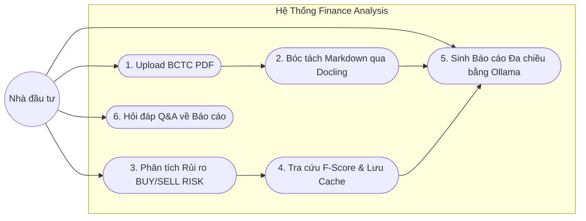

# TÀI LIỆU PHÂN TÍCH YÊU CẦU & GIẢI PHÁP HỆ THỐNG: FINANCE ANALYSIS
*(Áp dụng kỹ thuật BDA – Business & Solution Documentation Analysis theo chuẩn BABOK v3, IEEE 830 và Agile INVEST)*

---

## 1. Business Requirements Document (BRD) — Theo chuẩn BABOK v3

### 1.1. Thông tin Dự án
- **Tên dự án/hệ thống:** Finance Analysis (Hệ thống Phân tích Tài chính & Cổ phiếu Thông minh)
- **Phương pháp phân tích:** BDA (Business & Solution Documentation Analysis)
- **Phiên bản tài liệu:** 2.0
- **Trạng thái:** Đã phê duyệt kiến trúc (Approved)

### 1.2. Bối cảnh Kinh doanh & Tuyên bố Vấn đề (Problem Statement)
- **Thực trạng (As-Is):** 
  - Nhà đầu tư cá nhân và chuyên viên phân tích gặp quá tải khi phải đọc thủ công hàng chục trang Báo cáo tài chính (BCTC) định dạng PDF mỗi mùa công bố.
  - Các chỉ số tài chính (EPS, ROA, CFO, F-Score) thường nằm rải rác trong các bảng biểu phức tạp, dễ nhầm lẫn khi nhập liệu thủ công.
  - Dữ liệu cơ bản (Fundamental) và dữ liệu kỹ thuật thị trường (Technical) thường bị phân mảnh ở các công cụ khác nhau, dẫn đến việc nhà đầu tư thường mua đuổi ở vùng rủi ro cao (`BUY_RISK`) hoặc bán tháo hoảng loạn ở vùng cạn cung (`SELL_RISK`).
- **Mục tiêu mong đợi (To-Be):**
  - Một nền tảng tập trung duy nhất (**Finance Analysis**) có khả năng đọc hiểu nhanh BCTC PDF, tính toán định lượng rủi ro kỹ thuật, và dùng AI sinh báo cáo tổng hợp hỗ trợ người dùng ra quyết định **an toàn - nhanh chóng - đúng xu hướng**.

### 1.3. Mục tiêu Kinh doanh (Business Objectives - SMART)
1. **Rút ngắn thời gian phân tích:** Giảm thời gian đọc hiểu và tổng hợp BCTC từ 45 phút/mã xuống dưới **2 phút/mã**.
2. **Nâng cao tính an toàn giao dịch:** Cung cấp thang đo cảnh báo rủi ro định lượng khách quan (0-100), loại bỏ 100% cảm xúc fomo/hoảng loạn khi ra quyết định.
3. **Tuân thủ quy chuẩn tài chính:** Phân tích hoàn toàn khách quan theo xác suất xu hướng, tuân thủ nguyên tắc **không tư vấn/khuyến nghị mua bán cá nhân** (No-advice constraint).

### 1.4. Ma trận Các Bên Liên quan (Stakeholders)
| Vai trò | Đối tượng | Nhu cầu chính | Mức độ ảnh hưởng |
|---|---|---|---|
| **End-User (Nhà đầu tư cá nhân)** | Người giao dịch cổ phiếu | Đọc vị nhanh sức khỏe DN, cảnh báo điểm mua rủi ro, nắm bắt xu hướng | Cao |
| **Data/Risk Analyst** | Chuyên viên phân tích | Kiểm chứng logic F-Score, BUY_RISK, SELL_RISK có kiểm định | Cao |
| **System Admin/Developer** | Đội ngũ kỹ thuật | Vận hành hệ thống nhẹ, xử lý PDF nhanh, chi phí LLM tối ưu (Ollama local) | Trung bình |

---

## 2. Vision & Scope Document

### 2.1. Vision Statement
> **Dành cho** các nhà đầu tư và chuyên viên phân tích đang tìm kiếm cơ hội trên thị trường chứng khoán,  
> **Finance Analysis** là hệ thống trợ lý phân tích tài chính thông minh,  
> **giúp** tự động hóa việc đọc trích xuất BCTC PDF (thông qua Docling), định lượng cảnh báo rủi ro mua/bán (dựa trên tài liệu kiểm định rủi ro kỹ thuật), và tạo báo cáo tổng hợp bằng mô hình Ollama.  
> **Khác với** các giải pháp đọc thủ công hoặc các bảng lọc kỹ thuật đơn thuần, Finance Analysis kết hợp chặt chẽ giữa phân tích cơ bản đa chiều và kiểm soát rủi ro thị trường theo thời gian thực mà không đòi hỏi hạ tầng cồng kềnh.

### 2.2. In-Scope (Phạm vi triển khai)
- **Module 1: Document Processing (PDF to Markdown)**
  - Tải lên file PDF BCTC (Bảng CĐKT, KQKD, LCTT).
  - Sử dụng engine `Docling` để phân tích layout và giữ trọn vẹn 100% cấu trúc bảng biểu tài chính sang Markdown.
- **Module 2: Technical Risk Engine & Market Data**
  - Kéo dữ liệu lịch sử nến ngày qua `vnstock`.
  - Tính toán các chỉ báo kỹ thuật (RSI, MACD phân kỳ, ATR, Volume Ratio, Cấu trúc giá).
  - Xuất 2 điểm số độc lập: `BUY_RISK` (0-100) và `SELL_RISK` (0-100) kèm cấp độ cảnh báo (`NORMAL`, `WATCH`, `CAUTION`, `HIGH`).
- **Module 3: Fundamental & Risk Caching**
  - Tính toán Piotroski F-Score (0-9).
  - Cache kết quả vào bảng cơ sở dữ liệu `RiskAnalysisCache` (tránh gọi API lặp lại trong ngày).
- **Module 4: AI Analysis & Orchestration (Ollama)**
  - Đưa Markdown BCTC và điểm số rủi ro vào mô hình Ollama local (`llama3.1:8b` / `qwen2.5:7b`).
  - Sinh báo cáo tổng hợp 3 phần: [1] Sức khỏe DN, [2] Xu hướng kỹ thuật, [3] Nhận định rủi ro & Kịch bản an toàn.
  - Hỗ trợ Chat Q&A trực tiếp trên ngữ cảnh tài liệu vừa tải lên.

### 2.3. Out-of-Scope (Ngoài phạm vi)
- Không cung cấp tính năng Auto-trading (tự động đặt lệnh lên CTCK).
- Không cam kết/dự báo giá chắc chắn hay đưa ra khuyến nghị đầu tư cá nhân có tính pháp lý.
- Không lưu trữ vĩnh viễn vector database nặng nề; tài liệu xử lý theo phiên on-demand để tối ưu tài nguyên.

---

## 3. Functional Requirements Document (FRD)

### 3.1. Danh sách Yêu cầu Chức năng
| FR ID | Tên chức năng | Đầu vào (Input) | Đầu ra (Output) | Quy tắc nghiệp vụ liên kết | Độ ưu tiên |
|---|---|---|---|---|---|
| **FR-001** | Upload & Parse PDF BCTC | File PDF BCTC (<50MB) | Chuỗi cấu trúc Markdown | BR-001, BR-002 | Must-have |
| **FR-002** | Trích xuất Chỉ số Cơ bản qua LLM | Chuỗi Markdown BCTC | JSON các chỉ số (EPS, ROA, CFO, Doanh thu, Lợi nhuận) | BR-003 | Must-have |
| **FR-003** | Tính điểm Rủi ro Kỹ thuật | Mã cổ phiếu (Symbol), lịch sử OHLCV | `BUY_RISK`, `SELL_RISK`, `Reason Codes` | BR-004, BR-005 | Must-have |
| **FR-004** | Caching Phân tích Rủi ro | Kết quả F-Score, Risk Score | Bản ghi trong `RiskAnalysisCache` | BR-006 | Must-have |
| **FR-005** | Sinh Báo cáo Tổng hợp Đa chiều | Markdown BCTC + Risk Cache | Báo cáo Markdown 3 phần chuẩn hóa | BR-007 | Must-have |
| **FR-006** | Chat Q&A theo Báo cáo | Câu hỏi người dùng + Ngữ cảnh Markdown BCTC | Câu trả lời kèm dẫn chứng số trang | BR-008 | Should-have |

### 3.2. Quy tắc Nghiệp vụ (Business Rules - BR)
- **BR-001 (Bảo toàn Bảng biểu):** Trích xuất bảng BCTC bắt buộc phải giữ đúng mối quan hệ Cột - Dòng (không được làm phẳng thành văn bản vô nghĩa).
- **BR-002 (Giới hạn Kích thước):** Chỉ chấp nhận định dạng PDF chuẩn, dung lượng <= 50MB, tối đa 100 trang cho mỗi phiên phân tích.
- **BR-003 (Dữ liệu Point-in-Time):** Các số liệu BCTC chỉ có giá trị sau ngày công bố chính thức (`published_at`), không được lấy số liệu chưa kiểm toán thay thế khi chưa rõ nguồn.
- **BR-004 (Độc lập 2 cảnh báo):** `BUY_RISK` và `SELL_RISK` phải được chấm độc lập theo 2 logic đối nghịch (tránh dùng 1 điểm chung).
- **BR-005 (Điều kiện tối thiểu EOD):** Chỉ tính điểm kỹ thuật khi có tối thiểu 60 phiên dữ liệu giao dịch; nếu thiếu dữ liệu, phải trả cờ `INSUFFICIENT_DATA` thay vì đoán mò.
- **BR-006 (Cache Hợp lệ trong ngày):** Kết quả phân tích kỹ thuật và F-Score của một mã cổ phiếu được tái sử dụng trong ngày (EOD), chỉ tính toán lại khi có cờ `force_refresh=True`.
- **BR-007 (No-Advice Guardrail):** Báo cáo AI chỉ phân tích xác suất xu hướng và cảnh báo rủi ro, tuyệt đối không chứa các từ khẳng định "Chắc chắn mua", "Tất tay", "Cam kết lãi". Luôn kết thúc bằng Disclaimer.
- **BR-008 (Trích xuất có Căn cứ):** Chatbot chỉ trả lời dựa trên nội dung có trong BCTC; nếu không có thông tin, phải báo "Không tìm thấy trong báo cáo", không được bịa đặt dữ liệu (Hallucination).

---

## 4. Sơ đồ Use Case (Use Case Diagram)

---

## 5. User Stories & Tiêu chí Chấp nhận (INVEST Standard)

### US-001: Bóc tách BCTC bằng Docling & Trích xuất Chỉ số
**As a** nhà đầu tư,  
**I want to** tải file PDF báo cáo tài chính của doanh nghiệp lên hệ thống,  
**So that** hệ thống tự động bóc tách cấu trúc bảng biểu sang Markdown và dùng Ollama nhận diện các chỉ số quan trọng (Doanh thu, LNST, EPS, ROA, CFO).

**Acceptance Criteria (Gherkin):**
- **AC1.1:**
  - **Given** người dùng tải lên file PDF hợp lệ (<50MB) của công ty niêm yết
  - **When** bấm nút "Bắt đầu Phân tích"
  - **Then** hệ thống gọi Docling chuyển đổi sang Markdown và hoàn thành việc trích xuất bảng biểu trong vòng 60 giây.
- **AC1.2:**
  - **Given** file tải lên bị lỗi font hoặc là file scan trắng không có chữ
  - **When** hệ thống chạy Docling parser
  - **Then** trả về thông báo lỗi rõ ràng: `Không thể nhận diện văn bản trong PDF, vui lòng kiểm tra chất lượng file scan`.

**Priority:** Must-have | **Estimation:** 5 SP

---

### US-002: Đánh giá Điểm rủi ro Mua/Bán & Kịch bản Giao dịch
**As a** nhà đầu tư,  
**I want to** hệ thống tự động chấm điểm `BUY_RISK` và `SELL_RISK` cho mã cổ phiếu từ dữ liệu vnstock,  
**So that** tôi tránh được cạm bẫy mua đuổi đỉnh ngắn hạn hoặc bán tháo ngay đáy cạn cung.

**Acceptance Criteria (Gherkin):**
- **AC2.1:**
  - **Given** mã cổ phiếu có tín hiệu phân kỳ giảm RSI (`MOM_BEAR_DIV`) và Volume cao bất thường (`VOL_RATIO` >= 2.0)
  - **When** hệ thống tính toán `BUY_RISK`
  - **Then** điểm rủi ro trả về >= 75 (mức `HIGH`), hiển thị cảnh báo đỏ và gắn nhãn kịch bản: `GIẢM TỶ TRỌNG (Rủi ro mua đuổi cao)`.
- **AC2.2:**
  - **Given** mã cổ phiếu đã được tính toán trong ngày hôm nay và lưu trong `RiskAnalysisCache`
  - **When** người dùng yêu cầu xem lại mã này
  - **Then** hệ thống đọc trực tiếp từ cache DB trong dưới 200ms mà không cần gọi lại API bên thứ 3.

**Priority:** Must-have | **Estimation:** 3 SP

---

### US-003: Sinh Báo cáo Phân tích Đa chiều bằng Ollama
**As a** nhà đầu tư,  
**I want to** nhận được bản báo cáo tổng quan kết hợp giữa BCTC vừa tải lên và dữ liệu rủi ro kỹ thuật,  
**So that** tôi có thể đưa ra quyết định toàn diện về cả chất lượng doanh nghiệp lẫn thời điểm giao dịch.

**Acceptance Criteria (Gherkin):**
- **AC3.1:**
  - **Given** đã có dữ liệu Markdown từ PDF và kết quả tính toán rủi ro kỹ thuật
  - **When** người dùng yêu cầu "Sinh Báo cáo Tổng hợp"
  - **Then** Ollama tạo ra báo cáo Markdown đúng định dạng 3 phần: (1) Đánh giá Sức khỏe Doanh nghiệp, (2) Xu hướng & Vùng rủi ro Kỹ thuật, (3) Kịch bản an toàn tổng hợp kèm Disclaimer.

**Priority:** Must-have | **Estimation:** 5 SP

---

### US-004: Tương tác Q&A trực tiếp trên BCTC
**As a** nhà đầu tư,  
**I want to** trò chuyện/đặt câu hỏi với trợ lý ảo về các nội dung trong BCTC vừa upload,  
**So that** tôi có thể làm rõ các chi tiết đặc thù (VD: "Tại sao nợ vay ngắn hạn quý này tăng mạnh?").

**Acceptance Criteria (Gherkin):**
- **AC4.1:**
  - **Given** file BCTC đã được chuyển sang Markdown thành công trong phiên làm việc
  - **When** người dùng đặt câu hỏi tra cứu
  - **Then** trợ lý Ollama trả lời ngắn gọn, nêu rõ số liệu lấy từ bảng nào/mục nào trong báo cáo.

**Priority:** Should-have | **Estimation:** 3 SP

---

## 6. Yêu cầu Phi Chức năng (Non-Functional Requirements - NFR) — Chuẩn IEEE 830

- **NFR-001 (Hiệu năng / Performance):**
  - Thời gian parse PDF sang Markdown bằng Docling <= 90 giây cho tài liệu dưới 50 trang.
  - Thời gian phản hồi API tra cứu cache rủi ro <= 300ms.
- **NFR-002 (Bảo mật & Quyền riêng tư / Privacy):**
  - Toàn bộ quá trình suy luận AI chạy qua **Ollama Local**, không gửi nội dung tài liệu nhạy cảm của người dùng ra các dịch vụ AI bên ngoài nếu không có chỉ định.
- **NFR-003 (Độ tin cậy & Chống Hallucination / Reliability):**
  - Mọi số liệu tài chính trích xuất từ BCTC phải giữ nguyên giá trị gốc từ bảng biểu; tuyệt đối không để LLM làm tròn sai lệch hoặc tự suy đoán số liệu tài chính thiếu.
- **NFR-004 (Khả năng mở rộng / Scalability):**
  - Thiết kế kiến trúc tách biệt giữa Service phân tích kỹ thuật, Service parse tài liệu, và Service LLM Gateway để có thể triển khai độc lập (modular).
