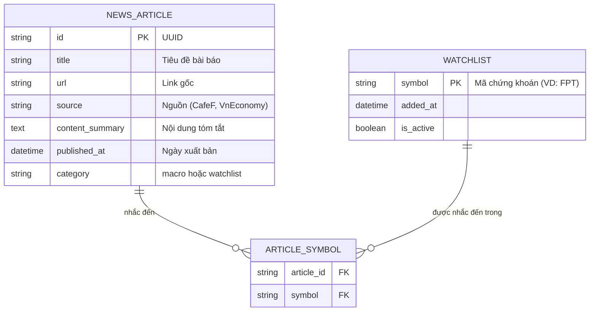

# Database Design & Data Engineering (ERD)

## 1. Lựa chọn Cơ sở dữ liệu
Hệ thống sử dụng **PostgreSQL (Serverless qua Neon.tech)**. Neon cung cấp giải pháp cơ sở dữ liệu đám mây hiệu năng cao (tách biệt compute và storage), tích hợp rất tốt với Python FastAPI thông qua SQLAlchemy hoặc SQLModel, đồng thời hỗ trợ Scale-to-Zero giúp tối ưu chi phí cho dự án cá nhân.

## 2. Entity Relationship Diagram (ERD)
Dưới đây là sơ đồ cơ sở dữ liệu để lưu trữ tin tức và danh mục theo dõi (Watchlist). Dữ liệu giá chứng khoán không lưu vào DB mà sẽ được cache in-memory hoặc lấy on-the-fly từ `vnstock`.

## 3. Data Engineering Strategies
- **Caching (Cache-aside):** Đối với các request lấy 3 chỉ số Index (VNINDEX, HNX, UPCOM) và Top 10, dữ liệu sẽ được cache vào RAM (sử dụng functools.lru_cache hoặc dictionary đơn giản) với TTL = 5 phút để tránh gọi hàm `vnstock` liên tục làm nghẽn.
- **Data Cleanup:** Để tối ưu hóa dung lượng lưu trữ trên Neon và giữ cho tốc độ truy vấn nhanh chóng, một Job chạy ngầm sẽ tự động xóa các bản ghi `NEWS_ARTICLE` cũ hơn 30 ngày.
