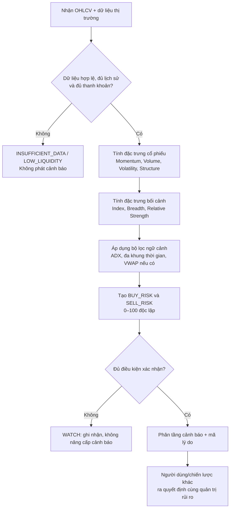

# Khung xác định vùng rủi ro mua/bán cổ phiếu

> **Mục đích:** Tài liệu mô tả logic phát hiện *vùng có xác suất bất lợi cao hơn thông thường* khi mở hoặc đóng vị thế. Đây là hệ thống cảnh báo và ưu tiên kiểm tra, **không phải** công cụ dự báo đỉnh/đáy, lệnh giao dịch tự động hay khuyến nghị đầu tư cá nhân. Mọi ngưỡng và trọng số chỉ là giả định ban đầu; chỉ được đưa vào vận hành sau khi backtest theo đúng thị trường, khung thời gian, chi phí và khẩu vị rủi ro đã chọn.

## 1. Phạm vi, đầu vào và nguyên tắc

### 1.1. Hai cảnh báo phải độc lập

Không dùng một điểm “nguy hiểm” chung cho cả mua và bán. Hai tình huống có logic đối nghịch:

| Cảnh báo | Câu hỏi hệ thống trả lời | Ý nghĩa vận hành |
|---|---|---|
| `BUY_RISK` | Mở vị thế mua ở thời điểm này có dễ gặp đảo chiều/nhịp điều chỉnh bất lợi không? | Cảnh báo mua đuổi hoặc mua trong điều kiện thị trường xấu. |
| `SELL_RISK` | Đóng vị thế ở thời điểm này có dễ bán vào pha cạn cung/rũ bỏ rồi hồi phục không? | Cảnh báo bán hoảng loạn; không đồng nghĩa phải giữ vị thế. |

`BUY_RISK` không phải là tín hiệu bán khống, và `SELL_RISK` không phải là tín hiệu mua. Hệ thống không được tự suy luận chiều lệnh chỉ từ một trong hai cảnh báo.

### 1.2. Dữ liệu tối thiểu

| Nhóm | Trường bắt buộc | Yêu cầu chất lượng |
|---|---|---|
| Giá | `open`, `high`, `low`, `close` đã điều chỉnh | Tối thiểu 252 phiên EOD; không có giá trị âm, trùng ngày hoặc nến lỗi. |
| Thanh khoản | `volume`, `value` (nếu có) | Tối thiểu 60 phiên; loại mã không đạt ngưỡng thanh khoản do sản phẩm cấu hình. |
| Bối cảnh | Chỉ số tham chiếu, độ rộng thị trường, ngành (nếu có) | Đồng bộ ngày giao dịch với mã; ghi nhận rõ nguồn và thời điểm chốt dữ liệu. |
| Sự kiện | Ngày chốt quyền, chia tách, tin/halt nếu nguồn hỗ trợ | Dùng giá đã điều chỉnh; gắn cờ để tránh coi biến động cơ học là tín hiệu. |

Nếu dữ liệu thiếu, chưa chốt nến, hoặc thanh khoản dưới ngưỡng tối thiểu, kết quả là `INSUFFICIENT_DATA` hoặc `LOW_LIQUIDITY`; **không được trả về điểm rủi ro**.

### 1.3. Khung thời gian và thời điểm đánh giá

- **Bản đầu tiên:** chỉ chấm điểm sau khi nến ngày đóng (`EOD_CONFIRMED`). Điều này hạn chế tín hiệu thay đổi liên tục trong phiên.
- **Intraday (nếu bổ sung):** chỉ là trạng thái `PRELIMINARY`; phải được tính lại và xác nhận bằng nến đóng. Không dùng bản intraday để phát lệnh tự động.
- Mọi chỉ báo chỉ dùng dữ liệu có thời điểm `<= as_of_timestamp`, nhằm tránh look-ahead bias khi backtest và vận hành.

## 2. Luồng ra quyết định



## 3. Đặc trưng và cách đo

Các điều kiện dưới đây là **cấu hình mẫu EOD**. Giá trị ngưỡng (`70`, `2.0`, `1.5`, …) phải đưa vào cấu hình, không hard-code.

| Mã | Đặc trưng | Cách tính/điều kiện mẫu | Diễn giải |
|---|---|---|---|
| `MOM_BEAR_DIV` | Phân kỳ giảm | Giá tạo pivot high mới trong 20–60 phiên, RSI(14) hoặc MACD histogram tạo pivot high thấp hơn; hai pivot cách nhau ≥ 5 phiên. | Động lượng không xác nhận mức giá cao mới. |
| `MOM_BULL_DIV` | Phân kỳ tăng | Giá tạo pivot low mới, RSI(14) hoặc MACD histogram tạo pivot low cao hơn; hai pivot cách nhau ≥ 5 phiên. | Động lượng không xác nhận mức giá thấp mới. |
| `PRICE_Z` | Cực trị giá | `(close - SMA(20)) / stddev(close, 20)`. | Đặt mức giá trong bối cảnh biến động gần đây; không tự nó là tín hiệu đảo chiều. |
| `VOL_RATIO` | Bùng nổ thanh khoản | `volume / SMA(volume, 20)`. | Nhận biết phiên giao dịch khác thường; cần đọc cùng cấu trúc nến. |
| `UPPER_WICK` | Râu nến trên | `(high - max(open, close)) / max(high - low, ε)`. | Lực bán xuất hiện ở vùng giá cao. |
| `LOWER_WICK` | Râu nến dưới | `(min(open, close) - low) / max(high - low, ε)`. | Lực mua phản ứng ở vùng giá thấp. |
| `ATR_RATIO` | Mở rộng biến động | `ATR(14) / SMA(ATR(14), 60)`. | Biến động hiện tại so với nền biến động của chính mã. |
| `STRUCTURE_DOWN` | Gãy cấu trúc ngắn hạn | `close < EMA(21)` sau một pivot high mới, hoặc đóng dưới đáy 5 phiên với `VOL_RATIO` cao. | Xác nhận suy yếu giá, không chỉ quá mua. |
| `STRUCTURE_UP` | Phục hồi cấu trúc ngắn hạn | Đóng trên đỉnh nến giảm mạnh gần nhất hoặc trên EMA(5) sau capitulation. | Xác nhận lực hồi ban đầu, không khẳng định tạo đáy. |
| `BREADTH` | Độ rộng thị trường | `% mã hợp lệ đóng trên MA50`; tính trên cùng universe, loại mã không đủ lịch sử. | Đo mức độ lan toả của xu hướng thị trường. |
| `REL_STRENGTH` | Sức mạnh tương đối | Lợi suất 20 phiên của mã trừ lợi suất 20 phiên của chỉ số. | Nhận biết mã yếu/mạnh tương đối với thị trường. |

`ε` là hằng số dương nhỏ để tránh chia cho 0. Pivot chỉ được xác nhận sau khi có số nến bên phải đã cấu hình; vì thế hệ thống phải lưu `pivot_confirmation_lag` trong kết quả.

### 3.1. Đặc trưng bổ sung và bộ lọc ngữ cảnh

Nhóm đặc trưng dưới đây bổ trợ cho RSI/MACD, khối lượng và wick. Chúng **không** được cộng trực tiếp vào điểm rủi ro mặc định, vì nhiều biến cùng đo một hiện tượng và sẽ tạo double-counting. Vai trò ưu tiên là kiểm tra độ tin cậy của bằng chứng đã có.

| Mã | Đặc trưng | Cách tính/điều kiện mẫu | Cách tích hợp |
|---|---|---|---|
| `MFI` | Money Flow Index | MFI(14), kết hợp giá điển hình và khối lượng để đo dòng tiền dương/âm trên thang 0–100. | Dùng làm bằng chứng phụ cho phân kỳ động lượng; không cộng thêm điểm nếu đã có RSI/MACD divergence. |
| `OBV_SLOPE` | Độ dốc On-Balance Volume | Hệ số dốc hồi quy tuyến tính của OBV trên 20 phiên, chuẩn hoá theo độ lệch chuẩn hoặc percentile lịch sử. | Gắn `ACCUMULATION_CONFIRM`/ `DISTRIBUTION_CONFIRM` khi dốc trái chiều với giá. |
| `AD_LINE_SLOPE` | Độ dốc Accumulation/Distribution | Hồi quy A/D Line trên 20 phiên; A/D dùng vị trí đóng cửa trong biên độ nến. | Bổ trợ cho wick và volume ratio; kiểm tra phân phối/tích luỹ qua nhiều phiên thay vì một nến. |
| `ADX` | Sức mạnh xu hướng | ADX(14) và hướng `+DI/-DI`. | Là bộ lọc: khi ADX thấp, phân kỳ đơn lẻ không đủ điều kiện nâng cấp `HIGH`; khi ADX cao, vẫn cần tín hiệu cấu trúc/khối lượng. |
| `MTF_TREND` | Xác nhận đa khung thời gian | Ví dụ: close tuần so với EMA(21) tuần, kết hợp cấu trúc pivot tuần. | Với `BUY_RISK`, khung tuần suy yếu làm bằng chứng ngày đáng tin hơn. Với `SELL_RISK`, một nhịp capitulation ngày trong xu hướng tuần chưa gãy là bằng chứng tránh bán hoảng loạn, không phải tín hiệu mua. |
| `VWAP_DEV` | Độ lệch VWAP | `(close - VWAP) / stddev` theo phiên hoặc tuần. | Chỉ tính khi có dữ liệu intraday đầy đủ và nhất quán; nếu chỉ có EOD thì trả `NOT_AVAILABLE`, không thay bằng SMA. |

**Quy tắc cổng xác nhận:**

- `BUY_RISK = HIGH` cần bằng chứng giá–khối lượng/cấu trúc như Mục 4. Nếu ADX thấp, bắt buộc phải có hai nhóm bằng chứng độc lập; phân kỳ RSI/MFI/OBV cùng chiều chỉ tính là một nhóm động lượng–dòng tiền.
- `SELL_RISK = HIGH` cần capitulation hoặc phân kỳ tăng **và** bằng chứng hồi phục. `MTF_TREND` chỉ có thể nâng độ tin cậy khi xu hướng tuần chưa gãy, không được thay thế bằng chứng hồi phục.
- `MFI`, `OBV_SLOPE` và `AD_LINE_SLOPE` phải lưu cùng cửa sổ tính, chuẩn hoá và giá trị thô trong `reason_codes` để kiểm tra lại.

### 3.2. Ký quỹ, bán giải chấp và bối cảnh giảm giá cơ học

Một nhịp giảm mạnh kèm khối lượng cao có thể phản ánh tin xấu cơ bản, thanh khoản suy kiệt hoặc bán giải chấp. Dữ liệu giá/khối lượng không đủ để khẳng định nguyên nhân; mọi cờ force-sell từ dữ liệu thị trường phải mang nhãn **suy luận**.

| Mã | Đặc trưng | Cách tính/nguồn | Cách tích hợp |
|---|---|---|---|
| `MARGIN_DEBT_CONTEXT` | Bối cảnh dư nợ margin | Dữ liệu công bố định kỳ ở cấp thị trường/công ty chứng khoán, nếu có ngày hiệu lực và quyền sử dụng rõ ràng. | Chỉ là biến ngữ cảnh; không nội suy thành dư nợ của từng mã khi không có nguồn trực tiếp. |
| `PRICE_DROP_STREAK` | Chuỗi giảm sâu | Số phiên liên tiếp đóng cửa giảm mạnh hoặc chạm/gần biên độ sàn, tính trên giá đã điều chỉnh. | Bằng chứng về áp lực giá; không tự xác định bán giải chấp. |
| `FORCED_SELL_SUSPECTED` | Cờ nghi ngờ bán giải chấp | Chỉ bật khi `PRICE_DROP_STREAK`, `EXCHANGE_LIMIT_HIT`, `VOL_RATIO` bất thường và bối cảnh margin cùng xuất hiện; ghi `inference_confidence`. | Là `reason_code` cho `SELL_RISK`, không cộng/trừ điểm và không được gọi là “đáy”. |

Khi `FORCED_SELL_SUSPECTED` bật, hệ thống phải yêu cầu thêm phiên xác nhận của `STRUCTURE_UP` và thanh khoản bình thường hoá trước khi coi capitulation là bằng chứng đủ mạnh. Nếu có tin công bố trọng yếu hoặc `PARTIAL_ADJUSTMENT`, cờ phải được hạ thành `EVENT_REVIEW_REQUIRED`.

### 3.3. Bối cảnh vĩ mô cho cổng xác nhận

Các feature vĩ mô được định nghĩa và lưu trữ tại `metric_finance_analysis.md`. Trong mô-đun này, chúng chỉ tác động đến chất lượng dữ liệu, phiên bản regime và yêu cầu đánh giá thủ công; không được cộng trực tiếp vào `BUY_RISK` hoặc `SELL_RISK`.

| Bối cảnh | Ảnh hưởng được phép |
|---|---|
| Lãi suất, tỷ giá hoặc dòng vốn thay đổi đột ngột | Gắn `MACRO_REGIME_CHANGED`; không so sánh trực tiếp kết quả với baseline regime cũ cho tới khi tái kiểm định. |
| Sự kiện ngành hoặc doanh nghiệp trọng yếu | Gắn `EVENT_REVIEW_REQUIRED`; tín hiệu kỹ thuật chỉ là bằng chứng phụ. |
| Dữ liệu vĩ mô bị trễ hoặc không rõ thời điểm công bố | Gắn `STALE_MACRO_DATA`; không dùng để xác nhận cảnh báo `HIGH`. |

Regime cuối cùng phải lưu cả `market_data_version`, `macro_data_version` và ngày hiệu lực, để backtest không vô tình sử dụng dữ liệu công bố sau thời điểm đánh giá.

## 4. Điểm rủi ro mua — `BUY_RISK` (0–100)

Mục tiêu là nhận biết điều kiện mua đuổi có bất lợi: giá ở cực trị, lực mua suy kiệt, biến động tăng và/hoặc bối cảnh thị trường không ủng hộ.

| Thành phần | Điểm tối đa | Cách chấm mẫu |
|---|---:|---|
| Động lượng suy kiệt | 25 | `25` khi `MOM_BEAR_DIV` được xác nhận; `10` khi RSI(14) > 70 nhưng chưa có phân kỳ; ngược lại `0`. |
| Phân phối giá–khối lượng | 25 | `25` khi `VOL_RATIO ≥ 2.0`, `UPPER_WICK ≥ 0.40` và close nằm ở nửa dưới biên độ nến; `10` khi chỉ có 2/3 điều kiện. |
| Biến động/cực trị giá | 20 | `20` khi `PRICE_Z ≥ 2.0` và `ATR_RATIO ≥ 1.5`; `8` khi chỉ có một điều kiện. |
| Cấu trúc giá | 15 | `15` khi `STRUCTURE_DOWN`; `0` nếu chưa gãy cấu trúc. |
| Bối cảnh thị trường | 15 | `15` khi chỉ số dưới EMA(21) **hoặc** breadth suy giảm 2 tuần liên tiếp, đồng thời `REL_STRENGTH < 0`; `5` khi chỉ có một tín hiệu. |

$$
BUY\_RISK = \min\left(100, \sum_i score_i\right)
$$

**Cổng xác nhận:** chỉ nâng `BUY_RISK` lên mức `HIGH` khi có ít nhất một tín hiệu thuộc nhóm *phân phối/cấu trúc* **và** ít nhất một tín hiệu thuộc nhóm *động lượng/biến động/bối cảnh*. RSI cao hoặc giá vượt Bollinger Band đơn lẻ chỉ tạo trạng thái theo dõi.

## 5. Điểm rủi ro bán — `SELL_RISK` (0–100)

Mục tiêu là nhận biết việc bán tùy ý có thể rơi đúng pha cạn cung/capitulation. Điểm cao **không vô hiệu hoá lệnh dừng lỗ, giới hạn rủi ro danh mục hay yêu cầu thanh khoản**.

| Thành phần | Điểm tối đa | Cách chấm mẫu |
|---|---:|---|
| Quá bán và phân kỳ tăng | 30 | `30` khi `MOM_BULL_DIV` xác nhận và RSI(14) < 35; `12` khi chỉ RSI(14) < 30. |
| Capitulation giá–khối lượng | 25 | `25` khi `VOL_RATIO ≥ 2.5`, `LOWER_WICK ≥ 0.35` và close hồi về nửa trên biên độ; `10` khi nến giảm mạnh kèm volume cao nhưng chưa hồi. |
| Biến động hoảng loạn | 15 | `15` khi `ATR_RATIO ≥ 1.75` và lợi suất 1 phiên thuộc 5% thấp nhất của 252 phiên; `0` nếu không. |
| Xác nhận hồi phục | 15 | `15` khi `STRUCTURE_UP`; `0` nếu chưa xuất hiện. |
| Bối cảnh thị trường | 15 | `15` khi breadth cải thiện từ vùng thấp và `REL_STRENGTH` chuyển dương; `5` khi chỉ có một điều kiện. |

$$
SELL\_RISK = \min\left(100, \sum_i score_i\right)
$$

**Cổng xác nhận:** `SELL_RISK` chỉ ở mức `HIGH` nếu có *capitulation* hoặc *phân kỳ tăng* **và** có một bằng chứng hồi phục. Một phiên giảm mạnh chưa hồi chỉ được gắn `WATCH`/`CAUTION`, không gọi là đáy.

## 6. Phân tầng, mã hành động và lý do giải thích

| Điểm sau cổng xác nhận | Trạng thái | `BUY_RISK` | `SELL_RISK` |
|---:|---|---|---|
| 0–39 | `NORMAL` | Không có hạn chế bổ sung từ mô-đun này. | Không có hạn chế bổ sung từ mô-đun này. |
| 40–59 | `WATCH` | Ghi nhận dấu hiệu; chờ nến xác nhận kế tiếp. | Ghi nhận dấu hiệu; không suy luận đảo chiều. |
| 60–74 | `CAUTION` | Trả cờ `REVIEW_NEW_LONG`; yêu cầu chiến lược phía trên đánh giá điểm dừng lỗ, quy mô và thanh khoản. | Trả cờ `REVIEW_DISCRETIONARY_SELL`; không chặn lệnh dừng lỗ bắt buộc. |
| 75–100 | `HIGH` | Trả cờ `BLOCK_NEW_LONG_UNTIL_REVIEW`; không tự động đóng vị thế đang có. | Trả cờ `PAUSE_NON_EMERGENCY_SELL_UNTIL_REVIEW`; lệnh giảm rủi ro bắt buộc vẫn được ưu tiên. |

Mỗi cảnh báo phải kèm `reason_codes` (ví dụ: `MOM_BEAR_DIV`, `VOLUME_CLIMAX`, `STRUCTURE_DOWN`), giá trị đầu vào, phiên dữ liệu và phiên bản cấu hình. Không trả về câu diễn giải như “chắc chắn tạo đỉnh/đáy”.

## 7. Pseudocode tham chiếu

```text
evaluate(symbol, as_of):
  if !is_eod_confirmed(as_of) or !has_required_history(symbol) or !is_liquid(symbol):
      return status = INSUFFICIENT_DATA | LOW_LIQUIDITY

  f = compute_features(symbol, as_of, adjusted_ohlcv, benchmark, breadth)
  context = compute_context_filters(f, adx, mtf_trend, vwap_if_available)
  buy_components  = score_buy_risk(f, config)
  sell_components = score_sell_risk(f, config)

  buy_score  = min(100, sum(buy_components))
  sell_score = min(100, sum(sell_components))

  buy_level  = apply_confirmation_gate(buy_score, f.buy_confirmation, context)
  sell_level = apply_confirmation_gate(sell_score, f.sell_confirmation, context)

  return {
    as_of, data_status, buy_score, buy_level, sell_score, sell_level,
    component_scores, context_filters, reason_codes,
    config_version, pivot_confirmation_lag
  }
```

## 8. Kiểm định trước khi dùng

### 8.1. Nhãn đánh giá và giả định

Không đánh giá bằng tỷ lệ “đoán đúng đỉnh/đáy”. Với mỗi ngày phát cảnh báo tại giá đóng $P_t$ và chân trời $h$ phiên:

$$
MAE_h = \frac{\min(P_{t+1},\ldots,P_{t+h})}{P_t} - 1
\qquad
MFE_h = \frac{\max(P_{t+1},\ldots,P_{t+h})}{P_t} - 1
$$

- `BUY_RISK` tốt khi các cảnh báo cấp cao đi kèm phân phối $MAE_h$ xấu hơn baseline cùng regime.
- `SELL_RISK` tốt khi các cảnh báo cấp cao đi kèm phân phối $MFE_h$ cao hơn baseline cùng regime.
- Ngưỡng “xấu/tốt” phải được xác định trước theo hồ sơ rủi ro, không tối ưu sau khi đã thấy kết quả.

### 8.2. Quy trình bắt buộc

1. Tách rõ tập huấn luyện, hiệu chỉnh và kiểm thử theo thời gian; tuyệt đối không xáo trộn dữ liệu chuỗi thời gian.
2. Dùng walk-forward validation, có giá điều chỉnh, ngày không giao dịch, phí, thuế, trượt giá và giới hạn thanh khoản phù hợp thị trường mục tiêu.
3. Đánh giá theo từng regime (tăng, giảm, đi ngang; biến động thấp/cao), vốn hoá và mức thanh khoản.
4. Báo cáo tối thiểu: số cảnh báo, coverage, precision tại ngưỡng 60/75, median $MAE_h$/$MFE_h$, false-positive rate và so sánh baseline.
5. Chỉ thay đổi trọng số/ngưỡng qua phiên bản cấu hình mới; lưu kết quả kiểm định và không ghi đè lịch sử cảnh báo.
6. Giảm survivorship bias: universe cần bao gồm cả mã đã huỷ niêm yết, tạm ngừng giao dịch hoặc không còn đủ điều kiện hiện tại, trong phạm vi dữ liệu cho phép.
7. Chạy sensitivity analysis cho các ngưỡng lân cận (ví dụ `VOL_RATIO` 1.8, 2.0, 2.2). Kết quả chỉ bền vững khi không đảo chiều mạnh bởi một thay đổi nhỏ của tham số.
8. Nếu diễn giải điểm 0–100 như xác suất, phải kiểm tra reliability curve theo từng regime và hiệu chỉnh sau tập validation riêng; không mặc định thang điểm tuyến tính là xác suất.
9. Giám sát model drift bằng phân phối đặc trưng, tỷ lệ cảnh báo và kết quả thực tế. Khi các chỉ số lệch đáng kể so với giai đoạn kiểm định, hạ cấu hình xuống `RESEARCH_ONLY` và hiệu chỉnh lại thay vì tiếp tục dùng ngưỡng cũ.
10. Với chiến lược có thực thi, mô phỏng bid–ask spread, market impact và độ sâu sổ lệnh. Nếu chỉ có EOD, proxy spread phải được gắn `ESTIMATED_SPREAD`, không trình bày như chi phí quan sát được.
11. Giới hạn quy mô lệnh theo tỷ lệ ADV cấu hình riêng cho từng tier thanh khoản; tham số có thể bắt đầu bằng khoảng bảo thủ nhưng chỉ được chốt sau khi hiệu chỉnh theo dữ liệu thực.

## 9. Kiểm soát rủi ro và giới hạn hệ thống

- Không dùng một chỉ báo đơn lẻ (RSI, MACD, Bollinger Bands hoặc ATR) làm điều kiện giao dịch.
- Cảnh báo kỹ thuật không thay thế đánh giá doanh nghiệp, thông tin công bố, sự kiện bất thường, giới hạn giá, thanh khoản hoặc quản trị danh mục.
- Không giả định lệnh dừng lỗ luôn khớp đúng mức giá trong thị trường biến động/gián đoạn. Cần mô phỏng trượt giá và khả năng không khớp trong backtest.
- Thiết lập giới hạn tỷ trọng theo mã/ngành và tổng rủi ro danh mục độc lập với mô-đun này; đa dạng hoá có thể giảm rủi ro nhưng không loại trừ thua lỗ.
- Lưu audit trail cho mỗi cảnh báo: dữ liệu đầu vào, kết quả, phiên bản công thức, người/chiến lược đã thực hiện hành động và lý do ghi đè (nếu có).

### 9.1. Ràng buộc vận hành cho thị trường Việt Nam

Các quy tắc dưới đây ảnh hưởng đến **khả năng diễn giải và thực thi**, không phải là thành phần cộng điểm. Giá trị quy định phải lấy từ cấu hình `exchange_rules_version` có ngày hiệu lực và nguồn chính thức, vì có thể thay đổi.

| Ràng buộc | Tác động lên hệ thống | Cách xử lý |
|---|---|---|
| Biên độ giá theo sàn | Giá trần/sàn làm biên độ nến, wick và khối lượng có thể phản ánh giới hạn cơ chế hơn là cung/cầu liên tục. | Lưu `EXCHANGE_LIMIT_HIT`, tỷ lệ phiên ở trần/sàn và không nâng cấp cảnh báo chỉ từ wick/volume của phiên đó. Cấu hình mặc định cần được đối chiếu quy định hiện hành của từng sàn. |
| ATO/ATC | Giá và khối lượng đấu giá là cơ chế khớp lệnh riêng. | Nếu nguồn dữ liệu tách được ATO/ATC, lưu thành trường riêng; backtest riêng ảnh hưởng của giá/khối lượng đấu giá trước khi dùng trong `PRICE_Z` hoặc `ATR_RATIO`. |
| Thanh toán T+2 | Cổ phiếu, chứng chỉ quỹ và chứng quyền có bảo đảm thanh toán T+2; khả năng bán phụ thuộc thời điểm nhận chứng khoán và dịch vụ của công ty chứng khoán. | Khi chiến lược giả định cần bán chứng khoán mới mua nhưng chưa khả dụng, trả cờ `SETTLEMENT_PENDING`. Không gọi cờ này là điểm rủi ro và không giả định khả năng ứng trước. |
| Room nhà đầu tư nước ngoài | Room còn lại và giao dịch nhà đầu tư nước ngoài có thể tạo ràng buộc thực thi hoặc bối cảnh riêng. | Chỉ dùng `foreign_room_available`/dòng tiền nội–ngoại khi nguồn dữ liệu có độ phủ và giấy phép phù hợp; không suy diễn từ `VOL_RATIO` hoặc `REL_STRENGTH` tổng. |
| Thanh khoản theo nhóm vốn hoá | Hành vi và khả năng khớp lệnh khác nhau giữa large-cap, mid-cap và mã thanh khoản thấp. | Cấu hình ngưỡng thanh khoản, giới hạn tỷ trọng và mô hình trượt giá theo tier; không dùng một ngưỡng chung cho toàn bộ universe. |

### 9.2. Quản trị vị thế và rủi ro danh mục

Mô-đun này không chọn quy mô lệnh. Nó chỉ cung cấp đầu vào cho lớp quản trị danh mục độc lập, lớp này phải xét đồng thời giới hạn tỷ trọng, tương quan, thanh khoản và kịch bản bất lợi.

| Phương pháp | Vai trò | Ràng buộc sử dụng |
|---|---|---|
| Kelly/fractional Kelly | Ước lượng quy mô lý thuyết từ xác suất và tỷ lệ lãi/lỗ của chiến lược. | Chỉ dùng khi xác suất được hiệu chỉnh ngoài mẫu; dùng fractional Kelly và trần tỷ trọng cứng vì sai số ước lượng có thể rất lớn. |
| VaR và CVaR/Expected Shortfall | Đo lường ngưỡng lỗ và mức lỗ trung bình ở đuôi phân phối. | Không thay thế stress test; phải nêu horizon, độ tin cậy, phương pháp ước lượng và giả định phân phối. |
| Ma trận tương quan | Phát hiện đa dạng hoá giả giữa các mã/ngành có biến động cùng chiều. | Cửa sổ tính và xử lý regime phải được version hoá; không chỉ dùng tương quan lịch sử tĩnh. |
| Stress testing | Áp kịch bản lịch sử và giả định lên danh mục hiện tại. | Bao gồm kịch bản thanh khoản giảm, spread nới rộng, giá chạm biên độ và dòng vốn rút mạnh. |

$$
f^* = \frac{p(b+1)-1}{b}
$$

Trong đó \(p\) là xác suất thắng đã hiệu chỉnh và \(b\) là tỷ lệ lãi/lỗ. Giá trị \(f^*\) chỉ là tham chiếu nghiên cứu, không phải tỷ trọng được phép tự động thực thi.

### 9.3. Sự kiện doanh nghiệp và độ sạch dữ liệu

| Sự kiện | Yêu cầu xử lý |
|---|---|
| Phát hành thêm, ESOP, trái phiếu chuyển đổi | Dùng số cổ phiếu pha loãng và lịch hiệu lực để kiểm tra EPS/BVPS; gắn `DILUTION_REVIEW_REQUIRED` nếu không có dữ liệu diluted EPS đáng tin cậy. |
| Chia tách, cổ tức cổ phiếu | Điều chỉnh giá, khối lượng và số cổ phiếu lịch sử theo cùng chính sách trước khi tính `PRICE_Z`, ATR hoặc volume ratio. |
| Cổ tức tiền mặt | Gắn ngày giao dịch không hưởng quyền; không coi gap điều chỉnh cơ học là phân phối hoặc phân kỳ giảm. |
| Dữ liệu điều chỉnh không đầy đủ | Trả `PARTIAL_ADJUSTMENT` và hạ mức tin cậy; không để feature kỹ thuật tạo cảnh báo `HIGH` chỉ từ giai đoạn đó. |

## 10. Tài liệu tham khảo

- Richard D. Wyckoff; Tom Williams, *Master the Markets* — khái niệm quan sát quan hệ giá–khối lượng; chỉ dùng như giả thuyết cần kiểm định.
- Marc Chaikin — nguồn gốc Accumulation/Distribution Line; dùng như đặc trưng dòng tiền cần kiểm định.
- J. Welles Wilder Jr., *New Concepts in Technical Trading Systems* (1978) — nguồn gốc DMI/ADX, RSI và ATR.
- [HOSE — Quy định giao dịch](https://staticfile.hsx.vn/Uploads/News/437a3bc734a845fc853283b0c627a593/20250429_20250429%20-%20HOSE%20-%20Quy%20dinh%20giao%20dich%20dang%20website%20HOSE.pdf) và [HNX — quy định biên độ HNX](https://hnx.vn/vi-vn/m-tin-tuc-hnx/Quy%20dinh%20ve%20gia%20tham%20chieu%20va%20bien%20do%20giao%20dich%20doi%20voi%20co%20phieu%20chuyen%20giao%20tu%20HOSE%20sang%20HNX-60011411-0.html) — nguồn kiểm tra cấu hình biên độ và cơ chế giao dịch theo sàn.
- [VSDC — Bù trừ và thanh toán](https://vsdc.vn/vi/sd/XAz40d2Q-9j569TvBgLQaQ) — quy định T+2 cho giao dịch cổ phiếu, chứng chỉ quỹ và chứng quyền có bảo đảm.
- [SSC — văn bản hợp nhất về hoạt động công ty chứng khoán và giao dịch](https://ssc.gov.vn/webcenter/portal/ubck/pages_r/l/chitit?dDocName=APPSSCGOVVN1620160533) và [HOSE — thông báo danh sách margin](https://staticfile.hsx.vn/Uploads/News/e9f173111262445bab199472351d7329/20250422_20250421%20-%20Danh%20sach%20bo%20sung%20khong%20duoc%20giao%20dich%20ky%20quy-CCC-%20Ra%20TVB.pdf) — nguồn kiểm tra quy định và điều kiện margin; không dùng làm dữ liệu suy đoán force-sell theo mã.
- Edward Thorp, *The Kelly Criterion in Blackjack, Sports Betting, and the Stock Market*; Philippe Jorion, *Value at Risk*; Larry Harris, *Trading and Exchanges* — tham khảo cho sizing, tail risk và vi cấu trúc.
- Marcos López de Prado, *Advances in Financial Machine Learning* — tham khảo về backtest overfitting và độ nhạy tham số.
- [U.S. SEC — Day Trading: Your Dollars at Risk](https://www.sec.gov/about/reports-publications/investorpubsdaytipshtm) — giao dịch ngắn hạn có rủi ro cao và không có lợi nhuận chắc chắn.
- [Investor.gov — Asset Allocation and Diversification](https://www.investor.gov/introduction-investing/getting-started/asset-allocation) — rủi ro danh mục còn phụ thuộc vào mục tiêu, thời hạn và mức chịu rủi ro của từng nhà đầu tư.
