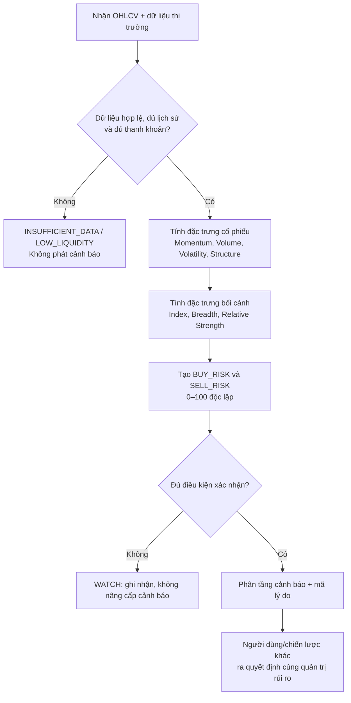

# Khung xác định vùng rủi ro mua/bán cổ phiếu

> **Mục đích:** Tài liệu mô tả logic phát hiện *vùng có xác suất bất lợi cao hơn thông thường* khi mở hoặc đóng vị thế. Đây là hệ thống cảnh báo và ưu tiên kiểm tra, **không phải** công cụ dự báo đỉnh/đáy, lệnh giao dịch tự động hay khuyến nghị đầu tư cá nhân. Mọi ngưỡng và trọng số chỉ là giả định ban đầu; chỉ được đưa vào vận hành sau khi backtest theo đúng thị trường, khung thời gian, chi phí và khẩu vị rủi ro đã chọn.

## 1. Phạm vi, đầu vào và nguyên tắc

### 1.1. Hai cảnh báo phải độc lập

Không dùng một điểm “nguy hiểm” chung cho cả mua và bán. Hai tình huống có logic đối nghịch:

| Cảnh báo | Câu hỏi hệ thống trả lời | Ý nghĩa vận hành |
|---|---|---|
| `BUY_RISK` | Mở vị thế mua ở thời điểm này có dễ gặp đảo chiều/nhịp điều chỉnh bất lợi không? | Cảnh báo mua đuổi hoặc mua trong điều kiện thị trường xấu. |
| `SELL_RISK` | Đóng vị thế ở thời điểm này có dễ bán vào pha cạn cung/rũ bỏ rồi hồi phục không? | Cảnh báo bán hoảng loạn; không đồng nghĩa phải giữ vị thế. |

`BUY_RISK` không phải là tín hiệu bán khống, và `SELL_RISK` không phải là tín hiệu mua. Hệ thống không được tự suy luận chiều lệnh chỉ từ một trong hai cảnh báo.

### 1.2. Dữ liệu tối thiểu

| Nhóm | Trường bắt buộc | Yêu cầu chất lượng |
|---|---|---|
| Giá | `open`, `high`, `low`, `close` đã điều chỉnh | Tối thiểu 252 phiên EOD; không có giá trị âm, trùng ngày hoặc nến lỗi. |
| Thanh khoản | `volume`, `value` (nếu có) | Tối thiểu 60 phiên; loại mã không đạt ngưỡng thanh khoản do sản phẩm cấu hình. |
| Bối cảnh | Chỉ số tham chiếu, độ rộng thị trường, ngành (nếu có) | Đồng bộ ngày giao dịch với mã; ghi nhận rõ nguồn và thời điểm chốt dữ liệu. |
| Sự kiện | Ngày chốt quyền, chia tách, tin/halt nếu nguồn hỗ trợ | Dùng giá đã điều chỉnh; gắn cờ để tránh coi biến động cơ học là tín hiệu. |

Nếu dữ liệu thiếu, chưa chốt nến, hoặc thanh khoản dưới ngưỡng tối thiểu, kết quả là `INSUFFICIENT_DATA` hoặc `LOW_LIQUIDITY`; **không được trả về điểm rủi ro**.

### 1.3. Khung thời gian và thời điểm đánh giá

- **Bản đầu tiên:** chỉ chấm điểm sau khi nến ngày đóng (`EOD_CONFIRMED`). Điều này hạn chế tín hiệu thay đổi liên tục trong phiên.
- **Intraday (nếu bổ sung):** chỉ là trạng thái `PRELIMINARY`; phải được tính lại và xác nhận bằng nến đóng. Không dùng bản intraday để phát lệnh tự động.
- Mọi chỉ báo chỉ dùng dữ liệu có thời điểm `<= as_of_timestamp`, nhằm tránh look-ahead bias khi backtest và vận hành.

## 2. Luồng ra quyết định



## 3. Đặc trưng và cách đo

Các điều kiện dưới đây là **cấu hình mẫu EOD**. Giá trị ngưỡng (`70`, `2.0`, `1.5`, …) phải đưa vào cấu hình, không hard-code.

| Mã | Đặc trưng | Cách tính/điều kiện mẫu | Diễn giải |
|---|---|---|---|
| `MOM_BEAR_DIV` | Phân kỳ giảm | Giá tạo pivot high mới trong 20–60 phiên, RSI(14) hoặc MACD histogram tạo pivot high thấp hơn; hai pivot cách nhau ≥ 5 phiên. | Động lượng không xác nhận mức giá cao mới. |
| `MOM_BULL_DIV` | Phân kỳ tăng | Giá tạo pivot low mới, RSI(14) hoặc MACD histogram tạo pivot low cao hơn; hai pivot cách nhau ≥ 5 phiên. | Động lượng không xác nhận mức giá thấp mới. |
| `PRICE_Z` | Cực trị giá | `(close - SMA(20)) / stddev(close, 20)`. | Đặt mức giá trong bối cảnh biến động gần đây; không tự nó là tín hiệu đảo chiều. |
| `VOL_RATIO` | Bùng nổ thanh khoản | `volume / SMA(volume, 20)`. | Nhận biết phiên giao dịch khác thường; cần đọc cùng cấu trúc nến. |
| `UPPER_WICK` | Râu nến trên | `(high - max(open, close)) / max(high - low, ε)`. | Lực bán xuất hiện ở vùng giá cao. |
| `LOWER_WICK` | Râu nến dưới | `(min(open, close) - low) / max(high - low, ε)`. | Lực mua phản ứng ở vùng giá thấp. |
| `ATR_RATIO` | Mở rộng biến động | `ATR(14) / SMA(ATR(14), 60)`. | Biến động hiện tại so với nền biến động của chính mã. |
| `STRUCTURE_DOWN` | Gãy cấu trúc ngắn hạn | `close < EMA(21)` sau một pivot high mới, hoặc đóng dưới đáy 5 phiên với `VOL_RATIO` cao. | Xác nhận suy yếu giá, không chỉ quá mua. |
| `STRUCTURE_UP` | Phục hồi cấu trúc ngắn hạn | Đóng trên đỉnh nến giảm mạnh gần nhất hoặc trên EMA(5) sau capitulation. | Xác nhận lực hồi ban đầu, không khẳng định tạo đáy. |
| `BREADTH` | Độ rộng thị trường | `% mã hợp lệ đóng trên MA50`; tính trên cùng universe, loại mã không đủ lịch sử. | Đo mức độ lan toả của xu hướng thị trường. |
| `REL_STRENGTH` | Sức mạnh tương đối | Lợi suất 20 phiên của mã trừ lợi suất 20 phiên của chỉ số. | Nhận biết mã yếu/mạnh tương đối với thị trường. |

`ε` là hằng số dương nhỏ để tránh chia cho 0. Pivot chỉ được xác nhận sau khi có số nến bên phải đã cấu hình; vì thế hệ thống phải lưu `pivot_confirmation_lag` trong kết quả.

## 4. Điểm rủi ro mua — `BUY_RISK` (0–100)

Mục tiêu là nhận biết điều kiện mua đuổi có bất lợi: giá ở cực trị, lực mua suy kiệt, biến động tăng và/hoặc bối cảnh thị trường không ủng hộ.

| Thành phần | Điểm tối đa | Cách chấm mẫu |
|---|---:|---|
| Động lượng suy kiệt | 25 | `25` khi `MOM_BEAR_DIV` được xác nhận; `10` khi RSI(14) > 70 nhưng chưa có phân kỳ; ngược lại `0`. |
| Phân phối giá–khối lượng | 25 | `25` khi `VOL_RATIO ≥ 2.0`, `UPPER_WICK ≥ 0.40` và close nằm ở nửa dưới biên độ nến; `10` khi chỉ có 2/3 điều kiện. |
| Biến động/cực trị giá | 20 | `20` khi `PRICE_Z ≥ 2.0` và `ATR_RATIO ≥ 1.5`; `8` khi chỉ có một điều kiện. |
| Cấu trúc giá | 15 | `15` khi `STRUCTURE_DOWN`; `0` nếu chưa gãy cấu trúc. |
| Bối cảnh thị trường | 15 | `15` khi chỉ số dưới EMA(21) **hoặc** breadth suy giảm 2 tuần liên tiếp, đồng thời `REL_STRENGTH < 0`; `5` khi chỉ có một tín hiệu. |

$$
BUY\_RISK = \min\left(100, \sum_i score_i\right)
$$

**Cổng xác nhận:** chỉ nâng `BUY_RISK` lên mức `HIGH` khi có ít nhất một tín hiệu thuộc nhóm *phân phối/cấu trúc* **và** ít nhất một tín hiệu thuộc nhóm *động lượng/biến động/bối cảnh*. RSI cao hoặc giá vượt Bollinger Band đơn lẻ chỉ tạo trạng thái theo dõi.

## 5. Điểm rủi ro bán — `SELL_RISK` (0–100)

Mục tiêu là nhận biết việc bán tùy ý có thể rơi đúng pha cạn cung/capitulation. Điểm cao **không vô hiệu hoá lệnh dừng lỗ, giới hạn rủi ro danh mục hay yêu cầu thanh khoản**.

| Thành phần | Điểm tối đa | Cách chấm mẫu |
|---|---:|---|
| Quá bán và phân kỳ tăng | 30 | `30` khi `MOM_BULL_DIV` xác nhận và RSI(14) < 35; `12` khi chỉ RSI(14) < 30. |
| Capitulation giá–khối lượng | 25 | `25` khi `VOL_RATIO ≥ 2.5`, `LOWER_WICK ≥ 0.35` và close hồi về nửa trên biên độ; `10` khi nến giảm mạnh kèm volume cao nhưng chưa hồi. |
| Biến động hoảng loạn | 15 | `15` khi `ATR_RATIO ≥ 1.75` và lợi suất 1 phiên thuộc 5% thấp nhất của 252 phiên; `0` nếu không. |
| Xác nhận hồi phục | 15 | `15` khi `STRUCTURE_UP`; `0` nếu chưa xuất hiện. |
| Bối cảnh thị trường | 15 | `15` khi breadth cải thiện từ vùng thấp và `REL_STRENGTH` chuyển dương; `5` khi chỉ có một điều kiện. |

$$
SELL\_RISK = \min\left(100, \sum_i score_i\right)
$$

**Cổng xác nhận:** `SELL_RISK` chỉ ở mức `HIGH` nếu có *capitulation* hoặc *phân kỳ tăng* **và** có một bằng chứng hồi phục. Một phiên giảm mạnh chưa hồi chỉ được gắn `WATCH`/`CAUTION`, không gọi là đáy.

## 6. Phân tầng, mã hành động và lý do giải thích

| Điểm sau cổng xác nhận | Trạng thái | `BUY_RISK` | `SELL_RISK` |
|---:|---|---|---|
| 0–39 | `NORMAL` | Không có hạn chế bổ sung từ mô-đun này. | Không có hạn chế bổ sung từ mô-đun này. |
| 40–59 | `WATCH` | Ghi nhận dấu hiệu; chờ nến xác nhận kế tiếp. | Ghi nhận dấu hiệu; không suy luận đảo chiều. |
| 60–74 | `CAUTION` | Trả cờ `REVIEW_NEW_LONG`; yêu cầu chiến lược phía trên đánh giá điểm dừng lỗ, quy mô và thanh khoản. | Trả cờ `REVIEW_DISCRETIONARY_SELL`; không chặn lệnh dừng lỗ bắt buộc. |
| 75–100 | `HIGH` | Trả cờ `BLOCK_NEW_LONG_UNTIL_REVIEW`; không tự động đóng vị thế đang có. | Trả cờ `PAUSE_NON_EMERGENCY_SELL_UNTIL_REVIEW`; lệnh giảm rủi ro bắt buộc vẫn được ưu tiên. |

Mỗi cảnh báo phải kèm `reason_codes` (ví dụ: `MOM_BEAR_DIV`, `VOLUME_CLIMAX`, `STRUCTURE_DOWN`), giá trị đầu vào, phiên dữ liệu và phiên bản cấu hình. Không trả về câu diễn giải như “chắc chắn tạo đỉnh/đáy”.

## 7. Pseudocode tham chiếu

```text
evaluate(symbol, as_of):
  if !is_eod_confirmed(as_of) or !has_required_history(symbol) or !is_liquid(symbol):
      return status = INSUFFICIENT_DATA | LOW_LIQUIDITY

  f = compute_features(symbol, as_of, adjusted_ohlcv, benchmark, breadth)
  buy_components  = score_buy_risk(f, config)
  sell_components = score_sell_risk(f, config)

  buy_score  = min(100, sum(buy_components))
  sell_score = min(100, sum(sell_components))

  buy_level  = apply_confirmation_gate(buy_score, f.buy_confirmation)
  sell_level = apply_confirmation_gate(sell_score, f.sell_confirmation)

  return {
    as_of, data_status, buy_score, buy_level, sell_score, sell_level,
    component_scores, reason_codes, config_version, pivot_confirmation_lag
  }
```

## 8. Kiểm định trước khi dùng

### 8.1. Nhãn đánh giá và giả định

Không đánh giá bằng tỷ lệ “đoán đúng đỉnh/đáy”. Với mỗi ngày phát cảnh báo tại giá đóng $P_t$ và chân trời $h$ phiên:

$$
MAE_h = \frac{\min(P_{t+1},\ldots,P_{t+h})}{P_t} - 1
\qquad
MFE_h = \frac{\max(P_{t+1},\ldots,P_{t+h})}{P_t} - 1
$$

- `BUY_RISK` tốt khi các cảnh báo cấp cao đi kèm phân phối $MAE_h$ xấu hơn baseline cùng regime.
- `SELL_RISK` tốt khi các cảnh báo cấp cao đi kèm phân phối $MFE_h$ cao hơn baseline cùng regime.
- Ngưỡng “xấu/tốt” phải được xác định trước theo hồ sơ rủi ro, không tối ưu sau khi đã thấy kết quả.

### 8.2. Quy trình bắt buộc

1. Tách rõ tập huấn luyện, hiệu chỉnh và kiểm thử theo thời gian; tuyệt đối không xáo trộn dữ liệu chuỗi thời gian.
2. Dùng walk-forward validation, có giá điều chỉnh, ngày không giao dịch, phí, thuế, trượt giá và giới hạn thanh khoản phù hợp thị trường mục tiêu.
3. Đánh giá theo từng regime (tăng, giảm, đi ngang; biến động thấp/cao), vốn hoá và mức thanh khoản.
4. Báo cáo tối thiểu: số cảnh báo, coverage, precision tại ngưỡng 60/75, median $MAE_h$/$MFE_h$, false-positive rate và so sánh baseline.
5. Chỉ thay đổi trọng số/ngưỡng qua phiên bản cấu hình mới; lưu kết quả kiểm định và không ghi đè lịch sử cảnh báo.

## 9. Kiểm soát rủi ro và giới hạn hệ thống

- Không dùng một chỉ báo đơn lẻ (RSI, MACD, Bollinger Bands hoặc ATR) làm điều kiện giao dịch.
- Cảnh báo kỹ thuật không thay thế đánh giá doanh nghiệp, thông tin công bố, sự kiện bất thường, giới hạn giá, thanh khoản hoặc quản trị danh mục.
- Không giả định lệnh dừng lỗ luôn khớp đúng mức giá trong thị trường biến động/gián đoạn. Cần mô phỏng trượt giá và khả năng không khớp trong backtest.
- Thiết lập giới hạn tỷ trọng theo mã/ngành và tổng rủi ro danh mục độc lập với mô-đun này; đa dạng hoá có thể giảm rủi ro nhưng không loại trừ thua lỗ.
- Lưu audit trail cho mỗi cảnh báo: dữ liệu đầu vào, kết quả, phiên bản công thức, người/chiến lược đã thực hiện hành động và lý do ghi đè (nếu có).

## 10. Tài liệu tham khảo

- J. Welles Wilder Jr., *New Concepts in Technical Trading Systems* (1978) — nền tảng RSI và ATR.
- Richard D. Wyckoff; Tom Williams, *Master the Markets* — khái niệm quan sát quan hệ giá–khối lượng; chỉ dùng như giả thuyết cần kiểm định.
- [U.S. SEC — Day Trading: Your Dollars at Risk](https://www.sec.gov/about/reports-publications/investorpubsdaytipshtm) — giao dịch ngắn hạn có rủi ro cao và không có lợi nhuận chắc chắn.
- [Investor.gov — Asset Allocation and Diversification](https://www.investor.gov/introduction-investing/getting-started/asset-allocation) — rủi ro danh mục còn phụ thuộc vào mục tiêu, thời hạn và mức chịu rủi ro của từng nhà đầu tư.

